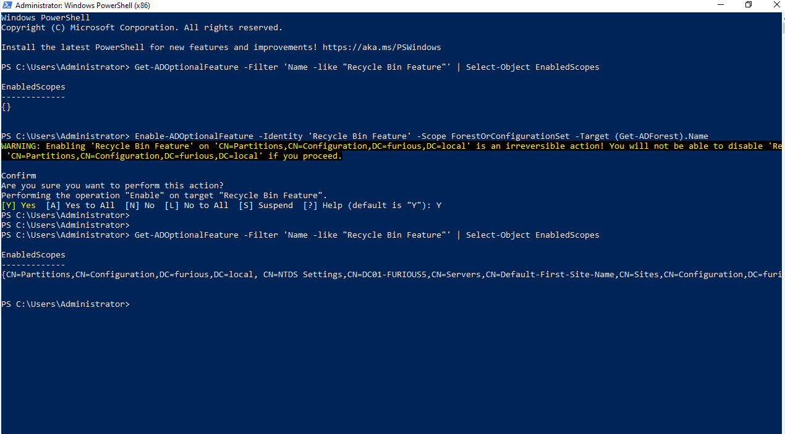
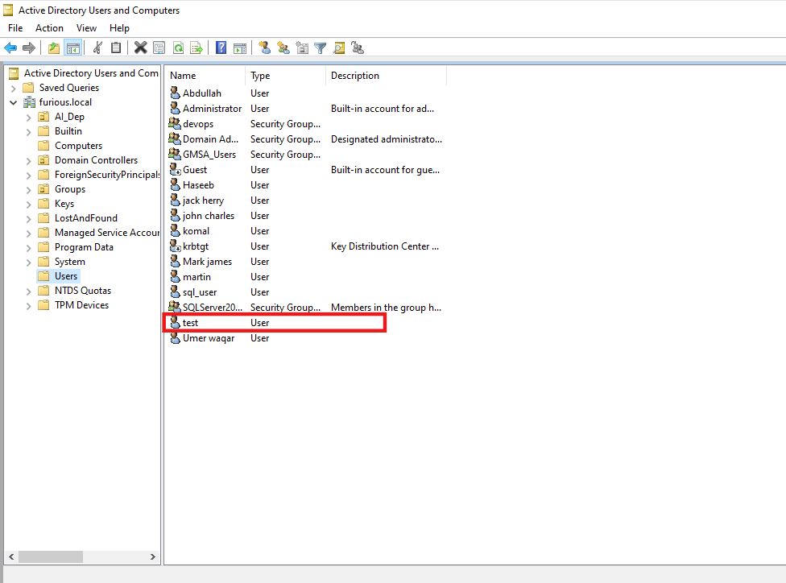
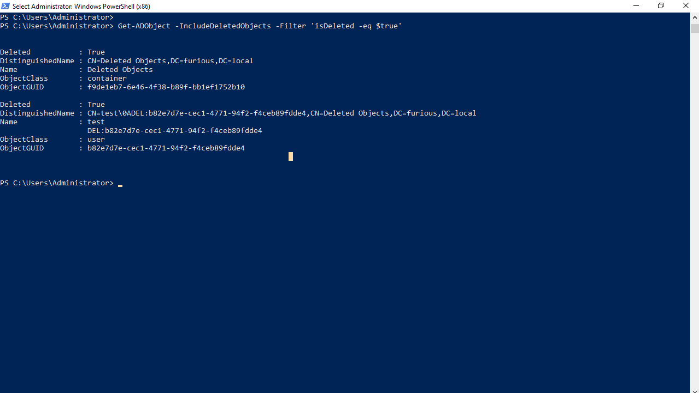
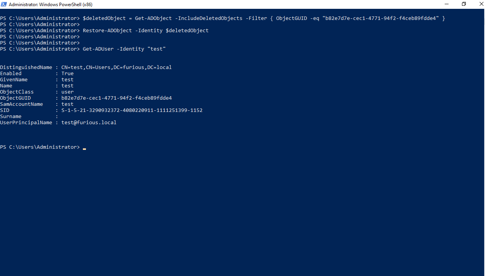

# 🔐 Tombstoned

##  What is a Tombstone in Active Directory?

In Active Directory (AD), when an object (like a user or group) is deleted, it isn't immediately removed from the database. Instead, it is **marked as a tombstone**. This tombstoned object is hidden and stripped of most attributes but retains essential identifiers like **SID** and **GUID**.

---

###  Purpose of Tombstoned Objects

1. **Accidental Deletion Recovery**

   * Retains the object's original **SID**, so if restored, it regains its previous permissions and access.
   * Useful for recovering mistakenly deleted users or groups.

2. **Replication of Deletion**

   * Ensures the deletion is **replicated across all Domain Controllers (DCs)** in the forest.
   * Prevents inconsistencies in distributed environments.

3. **Backup Restoration Integrity**

   * Prevents deleted objects from being resurrected when an **older DC is restored from backup**.
   * Ensures the deletion action is recognized post-restore.

---

###  How Tombstoning Works (Backend Process)

* AD checks if the object can be deleted.
* Sets `isDeleted = TRUE`.
* Strips non-essential attributes (e.g., group links are lost).
* Preserves critical attributes like **GUID** and **SID**.
* Moves the object to the `CN=Deleted Objects` container.

---

##  **Recycle Bin Must Be Enabled to Recover Deleted AD Accounts**

To recover deleted objects (like users) from Active Directory using PowerShell, the **Active Directory Recycle Bin** feature **must be enabled**. If it's not enabled, attempts to restore objects using `Restore-ADObject` will fail with an error:

---

###  Error when Recycle Bin is **not enabled**:

```powershell
Restore-ADObject -Identity $deletedObject
```

```
*Evil-WinRM* PS C:\Users\Administrator\Documents> Restore-ADObject -Identity $deletedObject
Illegal modify operation. Some aspect of the modification is not permitted
At line:1 char:1
+ Restore-ADObject -Identity $deletedObject
+ ~~~~~~~~~~~~~~~~~~~~~~~~~~~~~~~~~~~~~~~~~
    + CategoryInfo          : InvalidOperation: (CN=test\0ADEL:f...urious,DC=local:ADObject) [Restore-ADObject], ADIllegalModifyOperationException
    + FullyQualifiedErrorId : 0,Microsoft.ActiveDirectory.Management.Commands.RestoreADObject
```

This command attempts to restore a deleted AD object, but it will fail with an "Illegal modify operation" error if the Recycle Bin feature is not enabled.

---

###  Enable Recycle Bin Feature:

```powershell
Enable-ADOptionalFeature -Identity 'Recycle Bin Feature' -Scope ForestOrConfigurationSet -Target (Get-ADForest).Name
```


Enables the Recycle Bin feature at the forest level. This allows for full object recovery (including user accounts) in AD.

 **Note:** This action is **irreversible** — once enabled, it **cannot be disabled**.

---

###  Verify if Recycle Bin is Enabled:

```powershell
Get-ADOptionalFeature -Filter 'Name -like "Recycle Bin Feature"' | Select-Object EnabledScopes
```

Checks whether the Recycle Bin feature is currently enabled by showing the scopes it applies to. If the result is empty (`{}`), it's not enabled.



##  Creating and Deleting a User in Active Directory

Let’s say we want to create a test user and then delete it from Active Directory.

###  **Create a User:**

```powershell
New-ADUser -Name "Test" -SamAccountName "Test" -AccountPassword (ConvertTo-SecureString "Password123!" -AsPlainText -Force) -Enabled $true
```

Creates a new user named `Test` with the username (`SamAccountName`) `Test`, sets the password, and enables the account.




###  **Delete the User:**

```powershell
Remove-ADUser -Identity "Test"
```

Deletes the `Test` user from Active Directory. If Recycle Bin is enabled, this object can be recovered.

---

##  Enumerating Tombstoned (Deleted) Objects in Active Directory

Tombstoned objects are soft-deleted entries in AD that can be recovered **only if Recycle Bin is enabled**.

###  Find a Specific Deleted User (e.g., `test`):

```powershell
Get-ADObject -IncludeDeletedObjects -Filter 'isDeleted -eq $true' -Properties samaccountname | Where-Object { $_.samaccountname -like "test" }
```

Searches for deleted objects and filters for ones with a `samaccountname` that matches `"test"`.

###  List All Deleted AD Objects:

```powershell
Get-ADObject -Filter 'isDeleted -eq $true' -IncludeDeletedObjects
```

Enumerates all tombstoned objects (users, groups, etc.) currently in the AD Deleted Objects container.

---



## ♻️ Recover Deleted Account (from AD Recycle Bin)

```powershell
$deletedObject = Get-ADObject -IncludeDeletedObjects -Filter { ObjectGUID -eq "b82e7d7e-cec1-4771-94f2-f4ceb89fdde4" }
```

Fetches the soft-deleted object with the given ObjectGUID from Active Directory's deleted objects.


```powershell
Restore-ADObject -Identity $deletedObject
```

Restores the deleted object back into Active Directory (works only if Recycle Bin is enabled).


```powershell
Get-ADUser -Identity "test"
```

Verifies that the recovered user (`test`) now exists again in Active Directory.




##  Impact of Tombstoned Account Recovery

Recovering a tombstoned (soft-deleted) account can be **dangerous** in several ways. For example, if the deleted user was a **privileged account** such as a Domain Administrator, restoring it can give an attacker **immediate elevated access** to the Active Directory environment.

Additionally, if the recovered user had **delegated permissions** (e.g., rights over other users, groups, or systems), this can be exploited to perform further **Active Directory exploitation techniques**—such as privilege escalation, lateral movement, or Kerberoasting.

An attacker who regains access to a tombstoned user can chain this with **other AD-based attacks**, making tombstoned object enumeration a **valuable technique** during post-exploitation.


